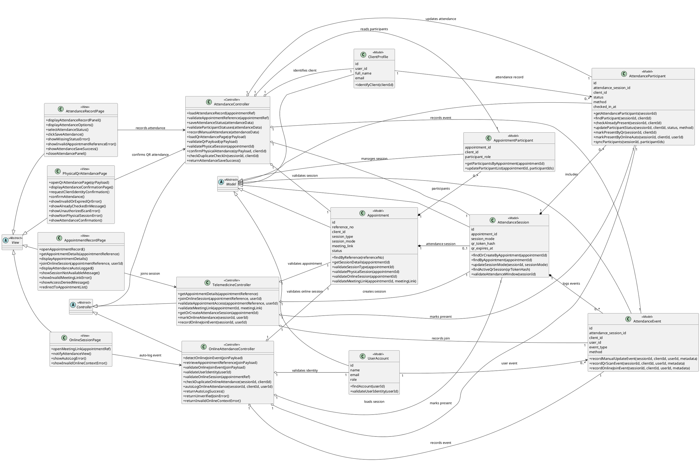
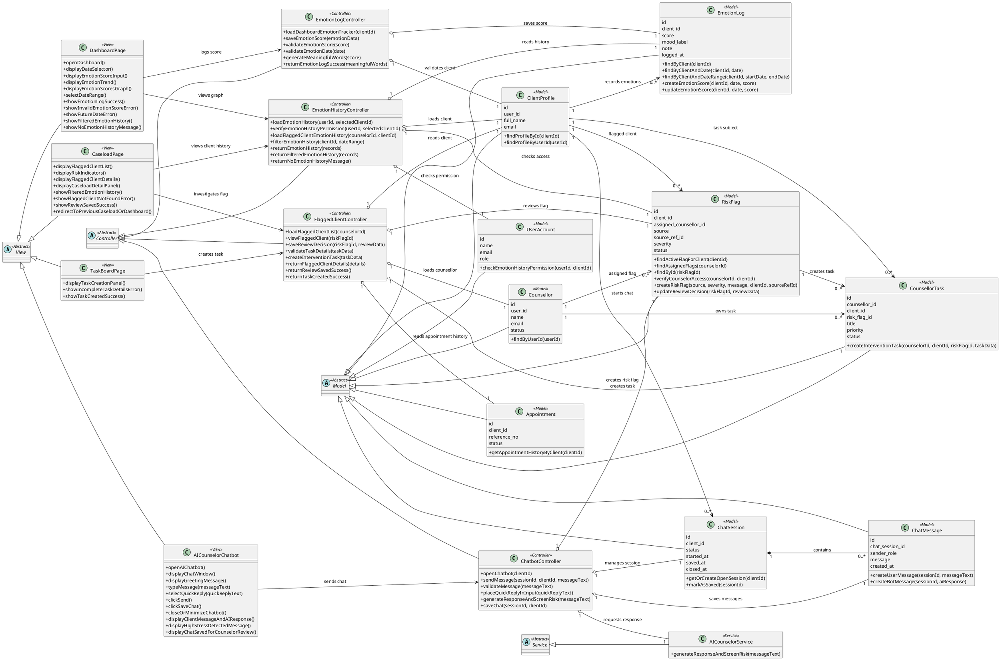
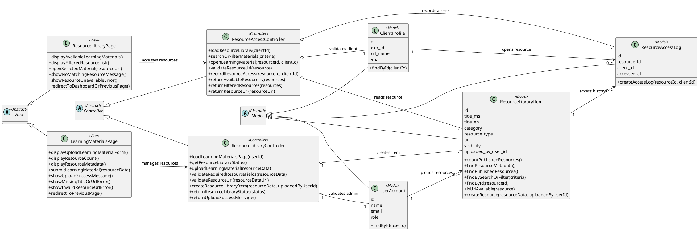

# PsyCare 2.0 SRS Class Diagrams (PlantUML)

This document contains the updated module-based SRS class diagrams for PsyCare 2.0 in PlantUML syntax.

The diagrams are now separated into the 8 system modules and include the classes used in the sequence diagrams:

- `<<View>>`
- `<<Controller>>`
- `<<Model>>`
- `<<Service>>`

Actors and the Supabase PostgreSQL database lifeline are not modeled as classes. Database-backed classes are represented by their related `<<Model>>` classes, and the full entity attributes are documented in `docs/entity-data-dictionary.md`.

Relationship notation used:

- `<|--` inheritance/generalization: a concrete class specializes an abstract layer class such as `View`, `Controller`, `Model`, or `Service`.
- `-->` association: one class is linked to or communicates with another class.
- `o--` aggregation: a controller/service coordinates model or service collaborators but does not own their lifecycle.
- `*--` composition: the parent owns child records/components that normally depend on the parent lifecycle.

## Diagram 1: User Management Module

Covered use cases: UM01 Onboard Counselor, UM02 Find Client Profile, UM03 Manage User Profile.

```plantuml
@startuml
left to right direction
skinparam classAttributeIconSize 0

abstract class View <<Abstract>> {
}

abstract class Controller <<Abstract>> {
}

abstract class Model <<Abstract>> {
}

class CounsellorPPsiPage <<View>> {
  +openCounsellorPPsiPage()
  +displayRecordsAndFilters()
  +displayAddCounsellorForm()
  +enterCounsellorDetails()
  +clickSave()
  +showConfirmSaveDialog()
  +showRequiredFieldsError()
  +showDuplicateRecordError()
  +showSuccessMessage()
  +enterSearchOrFilter()
  +displayMatchingRecords()
  +displayNoMatchingResults()
  +cancelOperation()
}

class ClientProfilePage <<View>> {
  +displayClientRecordsAndFilters()
  +displaySearchFields()
  +displayMatchingProfiles()
  +displayClientProfileSections()
  +displayInvalidSearchError()
  +displayNoMatchingProfiles()
  +displayAccessDenied()
  +redirectToPreviousPage()
}

class MyAccountPage <<View>> {
  +displayLockedClientInformationForm()
  +displayProfileLockedNotice()
  +displayReadOnlyTabFields()
  +returnToPreviousPage()
}

class ClientInformationPage <<View>> {
  +displayClientInformationList()
  +displayEditableClientForm()
  +showSaveConfirmationDialog()
  +showProfileValidationError()
  +showDuplicateProfileError()
  +showProfileSaveSuccess()
  +displayClientDetailTabs()
  +showTabUpdateSuccess()
}

class CounsellorController <<Controller>> {
  +loadCounsellorList()
  +saveCounsellor(formData)
  +validateCounsellorDetails()
  +requestSaveConfirmation()
  +confirmSaveCounsellor(formData)
  +searchCounsellors(criteria)
  +returnCounsellorList()
  +returnFilteredRecords(records)
  +returnValidationError()
  +returnDuplicateError()
  +returnSuccess()
}

class ClientProfileController <<Controller>> {
  +loadClientRecords()
  +searchClientProfiles(criteria)
  +validateSearchCriteria(criteria)
  +viewClientProfile(clientId)
  +verifyProfilePermission(userId, clientId)
  +returnClientRecordList()
  +returnMatchingProfiles(records)
  +returnClientProfileDetails(profileDetails)
  +returnInvalidSearchError()
  +returnNoMatchingProfiles()
  +returnAccessDenied()
}

class UserProfileController <<Controller>> {
  +loadMyAccount(userId)
  +loadClientInformationPage()
  +createOrEditClientProfile(formData)
  +validateProfileDetails(formData)
  +checkProfileConflict(formData)
  +requestSaveConfirmation()
  +saveClientProfile(formData)
  +loadClientProfileTabs(clientId)
  +updateClientProfileTabs(tabData)
  +returnProfileSaveSuccess()
  +returnTabUpdateSuccess()
  +returnWithoutSaving()
}

class UserAccount <<Model>> {
  id
  name
  email
  role
  status
  +createOrLinkCounsellorUser(formData)
  +findAccount(userId)
  +checkAdminPermission(userId)
  +checkViewPermission(userId, clientId)
}

class ClientProfile <<Model>> {
  id
  user_id
  full_name
  email
  matrix_no
  worker_no
  profile_locked
  +findByUserId(userId)
  +getClientProfiles()
  +getClientSummaries()
  +findByCriteria(criteria)
  +findProfileById(clientId)
  +checkDuplicateIdentifiers(email, phone, matrixNo, workerNo)
  +createProfile(formData)
  +updateProfile(clientId, formData)
  +updateProfileTabs(clientId, tabData)
}

class Counsellor <<Model>> {
  id
  user_id
  ppsi_no
  worker_no
  name
  counsellor_type
  location_id
  status
  +getCounsellors()
  +checkDuplicate(ppsiNo, workerNo, email)
  +createCounsellorProfile(formData, userId)
  +findByCriteria(criteria)
}

class CounsellingLocation <<Model>> {
  id
  code
  name
  campus
  address
  is_active
  +findLocation(locationId)
}

class Appointment <<Model>> {
  id
  reference_no
  client_id
  status
  +getAppointmentsByClient(clientId)
  +createOrUpdateAppointmentInfo(formData, clientId)
}

class Declaration <<Model>> {
  id
  client_id
  appointment_id
  status
  +getDeclarationsByClient(clientId)
  +updateConfirmationInfo(clientId, confirmationData)
}

View <|-- CounsellorPPsiPage
View <|-- ClientProfilePage
View <|-- MyAccountPage
View <|-- ClientInformationPage
Controller <|-- CounsellorController
Controller <|-- ClientProfileController
Controller <|-- UserProfileController
Model <|-- UserAccount
Model <|-- ClientProfile
Model <|-- Counsellor
Model <|-- CounsellingLocation
Model <|-- Appointment
Model <|-- Declaration
CounsellorPPsiPage --> CounsellorController : submits and filters
ClientProfilePage --> ClientProfileController : searches and opens profile
MyAccountPage --> UserProfileController : loads locked profile
ClientInformationPage --> UserProfileController : manages profile
CounsellorController "1" o-- "1" Counsellor : uses
CounsellorController "1" o-- "1" UserAccount : creates account
CounsellorController "1" o-- "1" CounsellingLocation : validates location
ClientProfileController "1" o-- "1" ClientProfile : reads profiles
ClientProfileController "1" o-- "1" UserAccount : checks permission
ClientProfileController "1" o-- "1" Appointment : loads appointment history
ClientProfileController "1" o-- "1" Declaration : loads declarations
UserProfileController "1" o-- "1" ClientProfile : manages profile
UserProfileController "1" o-- "1" UserAccount : checks account/admin
UserProfileController "1" o-- "1" Appointment : updates appointment info
UserProfileController "1" o-- "1" Declaration : updates confirmation info
UserAccount "1" --> "0..1" ClientProfile : has client profile
UserAccount "1" --> "0..1" Counsellor : has counsellor profile
CounsellingLocation "1" --> "0..*" Counsellor : assigned location
ClientProfile "1" --> "0..*" Appointment : owns appointments
ClientProfile "1" --> "0..*" Declaration : submits declarations
Appointment "1" --> "0..*" Declaration : attached declaration
@enduml
```

## Diagram 2: Telemedicine And Attendance Module

Covered use cases: TA01 Join Online Session, TA02 Record Attendance, TA03 Scan Physical QR Code, TA04 Auto-log Attendance(Online).

## Diagram 3: Declaration Module

Covered use cases: DC01 View Declaration Form, DC02 Submit Declaration, DC03 Verify Declaration.

```plantuml
@startuml
left to right direction
skinparam classAttributeIconSize 0

abstract class View <<Abstract>> {
}

abstract class Controller <<Abstract>> {
}

abstract class Model <<Abstract>> {
}

class DeclarationFormPage <<View>> {
  +displayDeclarationStatement()
  +displayClientIdentity()
  +displayDeclarationCheckbox()
  +displayCurrentDeclarationStatus()
  +displaySubmittedDate()
  +showCheckboxRequiredError()
  +showDeclarationUnavailableError()
  +showSubmittedStatus()
  +redirectOrRemainOnDeclarationSection()
}

class DeclarationReviewPage <<View>> {
  +displayDeclarationReviewDetails()
  +displayReviewStatusBlocks()
  +showIncompleteDeclarationError()
  +showAlreadyVerifiedMessage()
  +showVerificationSuccess()
  +showCorrectionRequiredSuccess()
  +redirectToPreviousReviewPage()
}

class DeclarationController <<Controller>> {
  +loadDeclarationForm(clientId, appointmentId)
  +getClientIdentity(clientId)
  +getCurrentDeclaration(clientId, appointmentId)
  +submitDeclaration(declarationData)
  +validateDeclarationCheckbox(isChecked)
  +validateRequiredDeclarationInfo(clientId, appointmentId)
  +recordSubmittedDeclaration(declarationData)
  +exposeForDeclarationVerification(declarationId)
  +returnDeclarationForm(declarationDetails)
  +returnSubmittedDeclarationStatus()
}

class DeclarationVerificationController <<Controller>> {
  +loadSubmittedDeclaration(declarationId)
  +validateVerifierPermission(userId)
  +verifyDeclaration(declarationId, verifierUserId)
  +requestDeclarationCorrection(declarationId, verifierUserId, correctionNote)
  +validateDeclarationCompleteness(declarationId)
  +checkAlreadyVerified(declarationId)
  +updateDeclarationStatus(declarationId, status)
  +recordVerificationEvent(declarationId, verifierUserId, action, note)
  +returnVerificationSuccess()
  +returnCorrectionRequiredSuccess()
}

class ClientProfile <<Model>> {
  id
  user_id
  full_name
  email
  profile_locked
  +findProfileById(clientId)
  +markDeclarationReviewRequired(clientId)
}

class UserAccount <<Model>> {
  id
  name
  email
  role
  +checkVerifierPermission(userId)
}

class Appointment <<Model>> {
  id
  reference_no
  client_id
  status
  +findAppointmentForDeclaration(appointmentId)
}

class Declaration <<Model>> {
  id
  client_id
  appointment_id
  declaration_text
  is_checked
  status
  submitted_at
  verified_by_user_id
  correction_note
  +findCurrentDeclaration(clientId, appointmentId)
  +validateRequiredInfo(clientId, appointmentId)
  +markSubmitted(declarationId)
  +findSubmittedDeclaration(declarationId)
  +validateCompleteness(declarationId)
  +checkAlreadyVerified(declarationId)
  +markVerified(declarationId, verifierUserId)
  +markCorrectionRequired(declarationId, correctionNote)
}

class DeclarationVerificationEvent <<Model>> {
  id
  declaration_id
  verifier_user_id
  action
  note
  +createVerificationEvent(declarationId, verifierUserId, action, note)
}

View <|-- DeclarationFormPage
View <|-- DeclarationReviewPage
Controller <|-- DeclarationController
Controller <|-- DeclarationVerificationController
Model <|-- ClientProfile
Model <|-- UserAccount
Model <|-- Appointment
Model <|-- Declaration
Model <|-- DeclarationVerificationEvent
DeclarationFormPage --> DeclarationController : loads and submits
DeclarationReviewPage --> DeclarationVerificationController : reviews
DeclarationController "1" o-- "1" ClientProfile : reads identity
DeclarationController "1" o-- "1" Declaration : submits declaration
DeclarationController "1" o-- "1" Appointment : optional appointment context
DeclarationVerificationController "1" o-- "1" UserAccount : checks verifier
DeclarationVerificationController "1" o-- "1" Declaration : updates status
DeclarationVerificationController "1" o-- "1" ClientProfile : marks review required
DeclarationVerificationController "1" o-- "1" DeclarationVerificationEvent : records event
ClientProfile "1" --> "0..*" Declaration : submits
Appointment "0..1" --> "0..*" Declaration : attached declaration
UserAccount "1" --> "0..*" Declaration : verifies
Declaration "1" *-- "0..*" DeclarationVerificationEvent : verification history
UserAccount "1" --> "0..*" DeclarationVerificationEvent : verifier
@enduml
```

## Diagram 4: Chatbot And Tracking Module

Covered use cases: CT01 Log Daily Emotion, CT02 Chat with AI Counselor, CT03 View Emotion History, CT04 Investigate Flagged Client.

## Diagram 5: Appointment Scheduling Module

Covered use cases: AS01 Book Appointment, AS02 Request Follow Up, AS03 Book New Appointment, AS04 Manage Slots, AS05 Bulk Generate Slots, AS06 Import CSV Timetable, AS07 Verify Appointment.

```plantuml
@startuml
scale max 3000 width
left to right direction
skinparam classAttributeIconSize 0

abstract class View <<Abstract>> {
}

abstract class Controller <<Abstract>> {
}

abstract class Model <<Abstract>> {
}

abstract class Service <<Abstract>> {
}

class SmartAppointmentForm <<View>> {
  +loadBookingForm(clientId)
  +displayBookingForm()
  +displayApplicantInformation()
  +displayCalendarAndSlotSelection()
  +displayAttachmentFields()
  +displayConfirmationFields()
  +displayBookingSummary()
  +showFollowUpBookingSummary()
  +showNoAvailableSlotError()
  +showIncompleteAppointmentInfoError()
  +showDraftSavedMessage()
}

class AppointmentRecordsPage <<View>> {
  +displayAppointmentRecords()
  +displaySelectedAppointmentSummary()
  +openFollowUpMode()
  +lockPreviousAppointmentReference()
  +displayFollowUpForm()
  +showFollowUpUnavailableMessage()
  +showAppointmentNotEligibleMessage()
  +showNoAvailableFollowUpSlotError()
}

class SlotManagerPage <<View>> {
  +displaySlotManagerPage()
  +displayConfiguredSlotOverview()
  +displayManualAddSlotControls()
  +displayBulkSetupSection()
  +displayCsvImportSection()
  +addManualSlotToDraft(slotDraft)
  +addGeneratedSlotsToDraft(generatedSlots)
  +addImportedSlotsToDraft(importedSlots)
  +removeSlotFromDraft(slotId)
  +markSavedSlotsForRemoval(existingSlots)
  +showImportSummary(importSummary)
  +showBulkGenerationSummary(summary)
  +showConfirmSaveDialog()
  +showSaveSuccessMessage()
}

class AppointmentQueuePage <<View>> {
  +displayPendingAppointmentQueue()
  +displayAppointmentDetails()
  +showAdminReviewConfirmation()
  +showCounsellorReviewConfirmation()
  +showSuccessMessage()
  +showAppointmentNotFoundError()
  +showMissingReviewInformationError()
  +showCounsellorApprovalUnavailableError()
}

class AppointmentController <<Controller>> {
  +loadBookingForm(clientId)
  +getAvailableSlots()
  +submitAppointmentRequest(formData)
  +validateAppointmentRequest(formData)
  +checkSlotAvailability(slotId, sessionType)
  +generateReferenceNumber()
  +createAppointment(formData, status)
  +createDeclaration(appointmentId, confirmationDetails)
  +generateMeetingLink(referenceNo)
  +updateMeetingLink(appointmentId, meetingLink)
  +returnBookingSummary(summary)
}

class NewAppointmentController <<Controller>> {
  +startNewAppointment(clientId)
  +generateSessionReferenceNumber()
  +loadAvailableSlots(criteria)
  +validateNewAppointmentDetails(formData)
  +validateSelectedSlot(slotId, sessionType)
  +prepareNewAppointmentDetails(formData)
  +saveDraftAppointment(formData)
  +returnCompletedNewAppointmentDetails(details)
}

class FollowUpAppointmentController <<Controller>> {
  +loadAppointmentRecords(clientId)
  +selectFollowUpAppointment(referenceNo)
  +validateFollowUpEligibility(appointmentId)
  +openFollowUpForm(previousAppointmentId)
  +validateFollowUpSlot(slotId, sessionType)
  +submitFollowUpRequest(followUpData)
  +returnFollowUpBookingSummary(summary)
}

class SlotManagementController <<Controller>> {
  +loadSlotManager(userId)
  +loadConfiguredSlots(filters)
  +addManualSlot(slotData)
  +validateSessionTypes(slotData)
  +validateSlotTime(slotData)
  +checkSlotOverlap(slotData)
  +removeDraftSlot(slotId)
  +markSavedSlotForRemoval(slotId)
  +receiveGeneratedSlotsFromAS05(generatedSlots, slotsMarkedForRemoval)
  +receiveImportedSlotsFromAS06(importedSlots, slotsMarkedForRemoval)
  +saveSlotChanges(draftChanges)
  +createSlotGenerationBatch(batchData)
  +deleteMarkedSavedSlots(slotIds)
  +saveDraftSlots(draftSlots, batchId)
}

class SlotBulkGenerationController <<Controller>> {
  +openBulkSetupSection(userId)
  +generateBulkSlots(criteria)
  +validateWeekdaySelection(criteria)
  +validateSessionTypeSelection(criteria)
  +validateDateRange(criteria)
  +findMatchingDates(criteria)
  +generateSlotDrafts(criteria, matchedDates)
  +applyReplaceExistingDates(matchedDates)
  +returnBulkGenerationSummary(summary, generatedSlots)
}

class SlotImportController <<Controller>> {
  +openCsvImportSection(userId)
  +importCsvSlots(csvFile, replaceExisting)
  +validateCsvFile(csvFile)
  +parseCsvFile(csvFile)
  +validateCsvRows(parsedRows)
  +resolveCsvCounsellors(validRows)
  +convertRowsToSlotDrafts(validRows)
  +applyReplaceExistingDates(importedDates)
  +returnImportSummary(importSummary)
}

class AppointmentVerificationController <<Controller>> {
  +loadPendingAppointmentQueue(userId, filters)
  +openAppointmentDetails(appointmentId)
  +validateAppointmentExists(appointmentId)
  +loadAppointmentReviewDetails(appointmentId)
  +approveForCounsellorReview(appointmentId, adminReviewData)
  +validateAdminReviewInformation(adminReviewData)
  +openCounsellorReviewAppointment(appointmentId, counsellorId)
  +validateCounsellorReviewEligibility(appointment)
  +approveAppointment(appointmentId, counsellorReviewData)
  +validateCounsellorReviewInformation(counsellorReviewData)
  +requestAppointmentStatusNotification(appointmentId, eventType)
}

class ClientProfile <<Model>> {
  id
  user_id
  full_name
  email
  +findClientProfileById(clientId)
  +findProfileById(clientId)
  +findByAppointment(appointmentId)
}

class UserAccount <<Model>> {
  id
  name
  email
  role
}

class Appointment <<Model>> {
  id
  reference_no
  client_id
  previous_appointment_id
  appointment_type
  session_type
  slot_id
  counsellor_id
  status
  meeting_link
  +generateReferenceNumber()
  +createAppointment(formData, status)
  +createDraftAppointment(formData)
  +updateMeetingLink(appointmentId, meetingLink)
  +findEligibleFollowUpRecords(clientId)
  +findByReference(referenceNo)
  +checkFollowUpStatus(appointmentId)
  +createFollowUpRequest(followUpData)
  +findPendingAppointments(filters)
  +findById(appointmentId)
  +findReviewDetails(appointmentId)
  +updateAdminReview(appointmentId, status, adminReviewData)
  +updateCounsellorReview(appointmentId, status, counsellorReviewData)
  +isReadyForCounsellorReview(appointment)
}

class AppointmentSlot <<Model>> {
  id
  slot_date
  start_time
  end_time
  counsellor_id
  location_id
  batch_id
  is_active
  +getAvailableSlots()
  +checkSlotAvailability(slotId, sessionType)
  +findAvailableSlots(criteria)
  +findAvailableSlot(slotId, sessionType)
  +reserveSlotForRequest(slotId)
  +findSlotById(slotId)
  +checkSessionTypeAllowed(slotId, sessionType)
  +findConfiguredSlots(filters)
  +buildManualSlotDraft(slotData)
  +buildDraftSlotsFromBulkCriteria(criteria, matchedDates)
  +buildDraftSlotsFromCsvRows(validRows)
  +checkOverlap(slotData)
  +findDraftSlotsByDates(dates)
  +removeDraftSlotsByDates(dates)
  +findSavedSlotsByDates(dates)
  +markSavedSlotsForRemoval(existingSlots)
  +deleteSlots(slotIds)
  +createSlots(draftSlots, batchId)
  +findByAppointment(appointmentId)
}

class AppointmentSlotSessionType <<Model>> {
  slot_id
  session_type
  +buildDraftSessionTypes(slotDraft, sessionTypes)
  +createSessionTypes(slotId, sessionTypes)
  +deleteBySlotIds(slotIds)
}

class AppointmentAttachment <<Model>> {
  id
  appointment_id
  file_name
  file_path
  +saveDraftAttachment(appointmentId, attachmentData)
}

class Declaration <<Model>> {
  id
  client_id
  appointment_id
  status
  +createDeclaration(appointmentId, confirmationDetails)
}

class Counsellor <<Model>> {
  id
  user_id
  name
  location_id
  status
  +findBySlot(slotId)
  +findActiveCounsellors()
  +findById(counsellorId)
  +findByCsvValue(counsellorValue)
}

class CounsellingLocation <<Model>> {
  id
  code
  name
  campus
  +findBySlot(slotId)
}

class SlotGenerationBatch <<Model>> {
  id
  created_by_user_id
  generation_method
  start_date
  end_date
  total_rows
  valid_rows
  skipped_rows
  +createBatch(batchData)
  +prepareBulkBatchSummary(startDate, endDate, matchedDates, generatedCount, replaceExisting)
  +prepareCsvBatchSummary(totalRows, validRows, skippedRows, replaceExisting)
}

class EmailNotification <<Model>> {
  id
  recipient_user_id
  appointment_id
  event_type
  status
  +createQueuedNotification(appointmentId, recipientUserId, eventType)
}

class MeetingLinkService <<Service>> {
  +generateMeetingLink(referenceNo)
}

class CsvImportService <<Service>> {
  +parseCsvFile(csvFile)
  +validateCsvTemplate(parsedRows)
  +extractValidRows(parsedRows)
  +countSkippedRows(parsedRows)
  +buildImportSummary(totalRows, validRows, skippedRows)
}

class AppointmentNotificationService <<Service>> {
  +queueAppointmentStatusNotification(appointmentId, eventType)
  +resolveNotificationRecipients(appointmentId)
  +buildAppointmentStatusNotification(appointmentId, eventType)
}

View <|-- SmartAppointmentForm
View <|-- AppointmentRecordsPage
View <|-- SlotManagerPage
View <|-- AppointmentQueuePage
Controller <|-- AppointmentController
Controller <|-- NewAppointmentController
Controller <|-- FollowUpAppointmentController
Controller <|-- SlotManagementController
Controller <|-- SlotBulkGenerationController
Controller <|-- SlotImportController
Controller <|-- AppointmentVerificationController
Model <|-- ClientProfile
Model <|-- UserAccount
Model <|-- Appointment
Model <|-- AppointmentSlot
Model <|-- AppointmentSlotSessionType
Model <|-- AppointmentAttachment
Model <|-- Declaration
Model <|-- Counsellor
Model <|-- CounsellingLocation
Model <|-- SlotGenerationBatch
Model <|-- EmailNotification
Service <|-- MeetingLinkService
Service <|-- CsvImportService
Service <|-- AppointmentNotificationService
SmartAppointmentForm --> AppointmentController : books appointment
SmartAppointmentForm --> NewAppointmentController : creates new appointment
AppointmentRecordsPage --> FollowUpAppointmentController : requests follow-up
SlotManagerPage --> SlotManagementController : manages slots
SlotManagerPage --> SlotBulkGenerationController : bulk setup
SlotManagerPage --> SlotImportController : csv import
AppointmentQueuePage --> AppointmentVerificationController : verifies appointment
AppointmentController "1" o-- "1" ClientProfile : loads client
AppointmentController "1" o-- "1" AppointmentSlot : checks slot
AppointmentController "1" o-- "1" Appointment : creates booking
AppointmentController "1" o-- "1" Declaration : creates declaration
AppointmentController "1" o-- "1" MeetingLinkService : creates online link
NewAppointmentController "1" o-- "1" AppointmentAttachment : saves attachment
FollowUpAppointmentController "1" o-- "1" Appointment : creates follow-up
FollowUpAppointmentController "1" o-- "1" AppointmentSlot : reserves slot
SlotManagementController "1" o-- "1" AppointmentSlot : manages slots
SlotManagementController "1" o-- "1" AppointmentSlotSessionType : manages session types
SlotManagementController "1" o-- "1" SlotGenerationBatch : creates batch
SlotManagementController "1" o-- "1" Counsellor : loads counsellors
SlotBulkGenerationController "1" o-- "1" AppointmentSlot : prepares drafts
SlotBulkGenerationController "1" o-- "1" AppointmentSlotSessionType : prepares session types
SlotBulkGenerationController "1" o-- "1" SlotGenerationBatch : prepares summary
SlotImportController "1" o-- "1" CsvImportService : parses csv
SlotImportController "1" o-- "1" AppointmentSlot : imports drafts
SlotImportController "1" o-- "1" AppointmentSlotSessionType : prepares session types
SlotImportController "1" o-- "1" Counsellor : resolves counsellor
AppointmentVerificationController "1" o-- "1" Appointment : reviews status
AppointmentVerificationController "1" o-- "1" AppointmentSlot : loads slot
AppointmentVerificationController "1" o-- "1" ClientProfile : loads client
AppointmentVerificationController "1" o-- "1" Counsellor : loads counsellor
AppointmentVerificationController "1" o-- "1" AppointmentNotificationService : queues notification
AppointmentNotificationService "1" o-- "1" EmailNotification : creates notification
ClientProfile "1" --> "0..*" Appointment : books
Appointment "0..1" --> "0..*" Appointment : follow up of
AppointmentSlot "1" --> "0..*" Appointment : selected slot
AppointmentSlot "1" *-- "1..*" AppointmentSlotSessionType : supports
Appointment "1" *-- "0..*" AppointmentAttachment : has attachments
Appointment "1" --> "0..*" Declaration : creates declaration
Counsellor "1" --> "0..*" AppointmentSlot : assigned slots
CounsellingLocation "1" --> "0..*" AppointmentSlot : hosts slots
SlotGenerationBatch "1" --> "0..*" AppointmentSlot : creates slots
UserAccount "1" --> "0..*" SlotGenerationBatch : creates batch
UserAccount "1" --> "0..*" EmailNotification : receives
Appointment "1" --> "0..*" EmailNotification : appointment notice
@enduml
```

## Diagram 6: Educational Resource Library Module

Covered use cases: ER01 Manage Resource Library, ER02 Access Learning Materials.

## Diagram 7: Peer Support Forum Module

Covered use cases: PS01 Submit Forum Post, PS02 Moderate Forum.

```plantuml
@startuml
left to right direction
skinparam classAttributeIconSize 0

abstract class View <<Abstract>> {
}

abstract class Controller <<Abstract>> {
}

abstract class Model <<Abstract>> {
}

abstract class Service <<Abstract>> {
}

class PeerSupportForumPage <<View>> {
  +displayForumPostForm()
  +displayCategoryOptions()
  +submitForumPost(postData)
  +showPostPublishedConfirmation()
  +showPostQueuedForReviewMessage()
  +showMissingPostDetailsError()
  +redirectToForumList()
}

class ForumModerationPage <<View>> {
  +displayForumModerationPage()
  +displayForumManagementFilters()
  +displayUnsafePostQueue()
  +displayAllForumPosts()
  +displayModerationEventLog()
  +displayMatchingForumPosts(posts)
  +showConfirmModerationDialog()
  +showModerationSuccessMessage()
  +showNoForumPostsFoundMessage()
  +showModerationActionFailedError()
}

class ForumPostController <<Controller>> {
  +openCreatePostForm(clientId)
  +loadActiveCategories()
  +submitForumPost(postData, clientId)
  +validateForumPostDetails(postData)
  +requestSafetyReview(postData)
  +determinePostStatus(safetyResult)
  +createForumPost(postData, clientId, safetyResult, status)
  +returnPostPublishedConfirmation()
  +returnPostQueuedForReviewMessage()
}

class ForumModerationController <<Controller>> {
  +loadForumModerationPage(adminUserId)
  +loadModerationDashboard(filters)
  +filterForumPosts(criteria)
  +moderateSelectedPost(postId, action, reason, adminUserId)
  +validateModerationAction(action)
  +determineNextPostStatus(action)
  +updateForumPostStatus(postId, nextStatus, reason)
  +recordModerationEvent(postId, adminUserId, action, previousStatus, nextStatus, reason)
  +returnModerationDashboard(dashboardData)
  +returnFilteredPosts(posts)
}

class ClientProfile <<Model>> {
  id
  user_id
  full_name
  email
  +findById(clientId)
}

class UserAccount <<Model>> {
  id
  name
  email
  role
  +findById(adminUserId)
}

class ForumCategory <<Model>> {
  id
  name
  is_active
  +findActiveCategories()
  +findById(categoryId)
}

class ForumPost <<Model>> {
  id
  author_client_id
  category_id
  title
  content
  safety_score
  moderation_reason
  status
  +findModerationDashboardPosts(filters)
  +findByCriteria(criteria)
  +findById(postId)
  +createPost(postData, clientId, categoryId, safetyScore, moderationReason, status)
  +updateStatus(postId, nextStatus, reason)
}

class ForumSupport <<Model>> {
  post_id
  client_id
  created_at
}

class ForumModerationEvent <<Model>> {
  id
  post_id
  moderator_user_id
  action
  previous_status
  next_status
  reason
  +findRecentEvents()
  +createModerationEvent(postId, adminUserId, action, previousStatus, nextStatus, reason)
}

class AiSafetyReviewService <<Service>> {
  +reviewForumPostSafety(title, content)
  +calculateSafetyScore(title, content)
  +returnSafetyResult(safetyScore, moderationReason)
}

View <|-- PeerSupportForumPage
View <|-- ForumModerationPage
Controller <|-- ForumPostController
Controller <|-- ForumModerationController
Model <|-- ClientProfile
Model <|-- UserAccount
Model <|-- ForumCategory
Model <|-- ForumPost
Model <|-- ForumSupport
Model <|-- ForumModerationEvent
Service <|-- AiSafetyReviewService
PeerSupportForumPage --> ForumPostController : submits post
ForumModerationPage --> ForumModerationController : moderates post
ForumPostController "1" o-- "1" ClientProfile : validates author
ForumPostController "1" o-- "1" ForumCategory : loads category
ForumPostController "1" o-- "1" AiSafetyReviewService : checks content
ForumPostController "1" o-- "1" ForumPost : creates post
ForumModerationController "1" o-- "1" UserAccount : validates admin
ForumModerationController "1" o-- "1" ForumPost : updates post
ForumModerationController "1" o-- "1" ForumModerationEvent : records action
ForumCategory "1" --> "0..*" ForumPost : categorizes
ClientProfile "1" --> "0..*" ForumPost : authors
ForumPost "1" --> "0..*" ForumSupport : receives support
ClientProfile "1" --> "0..*" ForumSupport : supports post
ForumPost "1" --> "0..*" ForumModerationEvent : moderation history
UserAccount "1" --> "0..*" ForumModerationEvent : moderates
@enduml
```

## Diagram 8: Psychometric Self-Assessment Module

Covered use cases: SA01 Take Psychometric Test, SA02 View Triage Dashboard, SA03 Manage Test.

```plantuml
@startuml
left to right direction
skinparam classAttributeIconSize 0

abstract class View <<Abstract>> {
}

abstract class Controller <<Abstract>> {
}

abstract class Model <<Abstract>> {
}

abstract class Service <<Abstract>> {
}

class PsychometricTestPage <<View>> {
  +openPsychometricTestPage()
  +displayAvailableTests()
  +displayQuestionsAndOptions()
  +displayProgressInformation()
  +submitTest(testId, clientId, answers)
  +displayConfirmationDialog()
  +displayResultSummary()
  +displaySupportRecommendation()
  +displayIncompleteAnswersMessage()
  +cancelTest()
}

class PsychometricTriagePage <<View>> {
  +displayTriageDashboard()
  +displayLatestSubmissions()
  +displayFilteredTriageResults(results)
  +displaySubmissionDetails(details)
  +showNoTriageResultsFoundMessage()
  +showSubmissionCannotBeLoadedError()
  +redirectToPreviousPageOrDashboard()
}

class TestingMaterialsPage <<View>> {
  +displayUploadTestingMaterialForm()
  +displayCurrentTestCount()
  +displayAvailableTestingMaterials()
  +submitPdfGenerationRequest(testData, pdfFile)
  +showGeneratedTestSuccessMessage(testCode, questionCount)
  +showMissingTitleOrPdfError()
  +showUnsupportedFileTypeError()
}

class PsychometricController <<Controller>> {
  +loadAvailableTests(clientId)
  +loadTestQuestions(testId)
  +submitTest(testId, clientId, answers)
  +validateAnswers(answers)
  +calculateTotalScore(answers)
  +calculateScorePercent(totalScore)
  +determineRiskLevel(scorePercent)
  +generateInterpretation()
  +createSubmission(testId, clientId, totalScore, scorePercent, riskLevel)
  +createAnswer(submissionId, questionId, optionValue)
  +createRiskFlag(source, severity, clientId, sourceRefId)
}

class PsychometricTriageController <<Controller>> {
  +loadTriageDashboard(counsellorId)
  +loadLatestSubmissions(filters)
  +searchOrFilterSubmissions(criteria)
  +openSubmissionDetails(submissionId)
  +loadSubmissionDetails(submissionId)
  +loadPsychometricRiskFlags(clientId)
  +returnTriageDashboard(results)
  +returnFilteredTriageResults(results)
  +returnSubmissionDetails(details)
}

class PsychometricTestController <<Controller>> {
  +loadTestingMaterialsPage(adminUserId)
  +getCurrentTestSummary()
  +uploadPdfAndGenerateTest(testData, pdfFile, adminUserId)
  +validateTestTitleAndPdf(testData, pdfFile)
  +validatePdfFileType(pdfFile)
  +generatePsychometricTestFromPdf(testData, pdfFile)
  +saveGeneratedTest(generatedTest, adminUserId)
  +returnCurrentTestSummary(summary)
  +returnGeneratedTestSuccessMessage(testCode, questionCount)
}

class UserAccount <<Model>> {
  id
  name
  email
  role
  +findById(adminUserId)
}

class ClientProfile <<Model>> {
  id
  user_id
  full_name
  email
  matrix_no
  worker_no
  +findBySubmission(submissionId)
  +findByCriteria(criteria)
}

class PsychometricTest <<Model>> {
  id
  code
  title_ms
  title_en
  category
  visibility
  uploaded_by_user_id
  +getPublishedTests()
  +countPublishedTests()
  +findAvailableTests()
  +findBySubmission(submissionId)
  +createGeneratedTest(generatedTest, adminUserId)
}

class PsychometricQuestion <<Model>> {
  id
  test_id
  position
  prompt_ms
  prompt_en
  +getQuestionsAndOptions(testId)
  +createGeneratedQuestions(testId, generatedQuestions)
}

class PsychometricOption <<Model>> {
  id
  test_id
  value
  label_ms
  label_en
  +createGeneratedOptions(testId, generatedOptions)
}

class PsychometricSubmission <<Model>> {
  id
  test_id
  client_id
  total_score
  score_percent
  risk_level
  submitted_at
  +createSubmission(testId, clientId, totalScore, scorePercent, riskLevel)
  +findLatestSubmissions(filters)
  +findByCriteria(criteria)
  +findById(submissionId)
}

class PsychometricAnswer <<Model>> {
  id
  submission_id
  question_id
  option_value
  +createAnswer(submissionId, questionId, optionValue)
  +findBySubmission(submissionId)
}

class RiskFlag <<Model>> {
  id
  client_id
  source
  source_ref_id
  severity
  status
  +createRiskFlag(source, severity, clientId, sourceRefId)
  +findOpenPsychometricFlags(clientId)
}

class PsychometricTestGenerationService <<Service>> {
  +extractPdfContent(pdfFile)
  +generateTestStructure(testTitle, pdfContent)
  +returnGeneratedTest(generatedTest)
}

View <|-- PsychometricTestPage
View <|-- PsychometricTriagePage
View <|-- TestingMaterialsPage
Controller <|-- PsychometricController
Controller <|-- PsychometricTriageController
Controller <|-- PsychometricTestController
Model <|-- UserAccount
Model <|-- ClientProfile
Model <|-- PsychometricTest
Model <|-- PsychometricQuestion
Model <|-- PsychometricOption
Model <|-- PsychometricSubmission
Model <|-- PsychometricAnswer
Model <|-- RiskFlag
Service <|-- PsychometricTestGenerationService
PsychometricTestPage --> PsychometricController : takes test
PsychometricTriagePage --> PsychometricTriageController : reviews triage
TestingMaterialsPage --> PsychometricTestController : manages tests
PsychometricController "1" o-- "1" PsychometricTest : loads tests
PsychometricController "1" o-- "1" PsychometricQuestion : loads questions
PsychometricController "1" o-- "1" PsychometricSubmission : saves submission
PsychometricController "1" o-- "1" PsychometricAnswer : saves answers
PsychometricController "1" o-- "1" RiskFlag : creates high-risk flag
PsychometricTriageController "1" o-- "1" PsychometricSubmission : loads submissions
PsychometricTriageController "1" o-- "1" PsychometricTest : loads test
PsychometricTriageController "1" o-- "1" PsychometricAnswer : loads answers
PsychometricTriageController "1" o-- "1" ClientProfile : loads client
PsychometricTriageController "1" o-- "1" RiskFlag : loads flags
PsychometricTestController "1" o-- "1" UserAccount : validates admin
PsychometricTestController "1" o-- "1" PsychometricTestGenerationService : generates test
PsychometricTestController "1" o-- "1" PsychometricTest : creates test
PsychometricTestController "1" o-- "1" PsychometricQuestion : creates questions
PsychometricTestController "1" o-- "1" PsychometricOption : creates options
UserAccount "1" --> "0..*" PsychometricTest : uploads tests
PsychometricTest "1" *-- "1..*" PsychometricQuestion : has questions
PsychometricTest "1" *-- "1..*" PsychometricOption : has options
PsychometricTest "1" --> "0..*" PsychometricSubmission : receives submissions
ClientProfile "1" --> "0..*" PsychometricSubmission : submits
PsychometricSubmission "1" *-- "1..*" PsychometricAnswer : has answers
PsychometricQuestion "1" --> "0..*" PsychometricAnswer : answered question
ClientProfile "1" --> "0..*" RiskFlag : psychometric flag
@enduml
```

