# PsyCare 2.0 SRS Component Diagram

This document contains the PlantUML component diagram for PsyCare 2.0 using an MVC-based structure.

The diagram follows this architecture:

- `View Layer`: Inertia React pages and role-based portals.
- `Routing Layer`: Laravel web routes and Inertia response boundary.
- `Controller Layer`: Laravel controllers grouped by system module.
- `Model / Domain Layer`: Laravel models and domain records that access Supabase PostgreSQL.
- `Service Layer`: Internal application services and external integration adapters.
- `Database Layer`: Supabase PostgreSQL.

Actors are shown only as external users of the web application. Database access is routed through models, not directly from views or controllers.

```plantuml
@startuml
left to right direction
skinparam componentStyle rectangle
skinparam packageStyle rectangle
skinparam shadowing false
skinparam defaultTextAlignment center

actor Client
actor Admin
actor Counsellor

package "Client Device" {
  component "Web Browser" as Browser
}

package "View Layer\nInertia React Pages" as ViewLayer {
  component "Client Portal Views\nDashboard, Smart Appointment Form,\nAppointment Records, Psychometric Test,\nResource Library, Peer Support Forum,\nAI Chatbot" as ClientViews <<View>>
  component "Admin Portal Views\nCounsellor PPsi, Client Information,\nAppointment Queue, Testing Materials,\nLearning Materials, Forum Moderation" as AdminViews <<View>>
  component "Counsellor Portal Views\nAppointments, Slot Manager,\nCaseload, Task Board,\nPsychometric Triage, Attendance" as CounsellorViews <<View>>
}

package "Routing Layer\nLaravel + Inertia" as RoutingLayer {
  component "Laravel Web Routes" as WebRoutes <<Route>>
  component "Inertia Response Adapter" as InertiaAdapter <<Adapter>>
}

package "Controller Layer\nLaravel MVC Controllers" as ControllerLayer {
  component "User Management Controllers\nCounsellorController\nClientProfileController\nUserProfileController" as UserControllers <<Controller>>
  component "Appointment Scheduling Controllers\nAppointmentController\nNewAppointmentController\nFollowUpAppointmentController\nSlotManagementController\nSlotBulkGenerationController\nSlotImportController\nAppointmentVerificationController" as AppointmentControllers <<Controller>>
  component "Telemedicine & Attendance Controllers\nTelemedicineController\nAttendanceController\nOnlineAttendanceController" as AttendanceControllers <<Controller>>
  component "Declaration Controllers\nDeclarationController\nDeclarationVerificationController" as DeclarationControllers <<Controller>>
  component "Chatbot & Tracking Controllers\nEmotionLogController\nEmotionHistoryController\nChatbotController\nFlaggedClientController" as TrackingControllers <<Controller>>
  component "Resource Library Controllers\nResourceLibraryController\nResourceAccessController" as ResourceControllers <<Controller>>
  component "Peer Support Forum Controllers\nForumPostController\nForumModerationController" as ForumControllers <<Controller>>
  component "Psychometric Controllers\nPsychometricController\nPsychometricTriageController\nPsychometricTestController" as PsychometricControllers <<Controller>>
}

package "Model / Domain Layer\nLaravel Models" as ModelLayer {
  component "User Domain Models\nUserAccount, ClientProfile,\nCounsellor, CounsellingLocation" as UserModels <<Model>>
  component "Appointment Domain Models\nAppointment, AppointmentSlot,\nAppointmentSlotSessionType,\nAppointmentAttachment,\nSlotGenerationBatch, EmailNotification" as AppointmentModels <<Model>>
  component "Attendance Domain Models\nAppointmentParticipant,\nAttendanceSession,\nAttendanceParticipant,\nAttendanceEvent" as AttendanceModels <<Model>>
  component "Declaration Domain Models\nDeclaration,\nDeclarationVerificationEvent" as DeclarationModels <<Model>>
  component "Tracking Domain Models\nEmotionLog, ChatSession,\nChatMessage, RiskFlag,\nCounsellorTask" as TrackingModels <<Model>>
  component "Resource Domain Models\nResourceLibraryItem,\nResourceAccessLog" as ResourceModels <<Model>>
  component "Forum Domain Models\nForumCategory, ForumPost,\nForumSupport, ForumModerationEvent" as ForumModels <<Model>>
  component "Psychometric Domain Models\nPsychometricTest,\nPsychometricQuestion,\nPsychometricOption,\nPsychometricSubmission,\nPsychometricAnswer" as PsychometricModels <<Model>>
}

package "Internal Service Layer" as ServiceLayer {
  component "Meeting Link Service" as MeetingLinkService <<Service>>
  component "CSV Import Service" as CsvImportService <<Service>>
  component "Appointment Notification Service" as AppointmentNotificationService <<Service>>
  component "AI Counsellor Service Adapter" as AICounsellorAdapter <<Service>>
  component "Forum Safety Review Adapter" as ForumSafetyAdapter <<Service>>
  component "Psychometric Test Generation Service" as PsychometricGenerationService <<Service>>
  component "QR Attendance Service" as QrAttendanceService <<Service>>
  component "File / Resource Storage Adapter" as FileStorageAdapter <<Service>>
}

package "External Services" as ExternalLayer {
  component "AI / NLP Screening Service" as AiNlpService <<External>>
  component "Online Meeting Platform" as OnlineMeetingPlatform <<External>>
  component "Email Delivery Service" as EmailDeliveryService <<External>>
  component "Supabase Storage" as SupabaseStorage <<External>>
}

database "Supabase PostgreSQL Database" as SupabaseDb <<Database>>

Client --> Browser : uses
Admin --> Browser : uses
Counsellor --> Browser : uses

Browser --> ClientViews : opens client portal
Browser --> AdminViews : opens admin portal
Browser --> CounsellorViews : opens counsellor portal

ClientViews --> WebRoutes : submits requests
AdminViews --> WebRoutes : submits requests
CounsellorViews --> WebRoutes : submits requests
WebRoutes --> InertiaAdapter : renders pages
InertiaAdapter --> ClientViews : returns page props
InertiaAdapter --> AdminViews : returns page props
InertiaAdapter --> CounsellorViews : returns page props

WebRoutes --> UserControllers : routes user/profile actions
WebRoutes --> AppointmentControllers : routes appointment actions
WebRoutes --> AttendanceControllers : routes attendance actions
WebRoutes --> DeclarationControllers : routes declaration actions
WebRoutes --> TrackingControllers : routes tracking actions
WebRoutes --> ResourceControllers : routes resource actions
WebRoutes --> ForumControllers : routes forum actions
WebRoutes --> PsychometricControllers : routes psychometric actions

UserControllers --> UserModels : reads/writes profile data
UserControllers --> AppointmentModels : loads appointment history
UserControllers --> DeclarationModels : loads declaration history

AppointmentControllers --> UserModels : validates client/counsellor
AppointmentControllers --> AppointmentModels : manages booking, slots, queue
AppointmentControllers --> DeclarationModels : creates declaration record
AppointmentControllers --> MeetingLinkService : requests online link
AppointmentControllers --> CsvImportService : imports timetable slots
AppointmentControllers --> AppointmentNotificationService : queues notices

AttendanceControllers --> UserModels : identifies attendee
AttendanceControllers --> AppointmentModels : validates appointment
AttendanceControllers --> AttendanceModels : records attendance
AttendanceControllers --> QrAttendanceService : validates QR token

DeclarationControllers --> UserModels : checks verifier/client
DeclarationControllers --> AppointmentModels : loads appointment context
DeclarationControllers --> DeclarationModels : submits and verifies declaration

TrackingControllers --> UserModels : validates client/counsellor access
TrackingControllers --> AppointmentModels : loads appointment history
TrackingControllers --> TrackingModels : logs emotion, chat, flags, tasks
TrackingControllers --> AICounsellorAdapter : generates AI response

ResourceControllers --> UserModels : validates user
ResourceControllers --> ResourceModels : manages resources and access logs
ResourceControllers --> FileStorageAdapter : stores or opens resource file

ForumControllers --> UserModels : validates author/moderator
ForumControllers --> ForumModels : creates and moderates posts
ForumControllers --> ForumSafetyAdapter : screens forum content

PsychometricControllers --> UserModels : validates client/admin/counsellor
PsychometricControllers --> PsychometricModels : manages tests and submissions
PsychometricControllers --> TrackingModels : creates risk flags
PsychometricControllers --> PsychometricGenerationService : generates tests from PDF

MeetingLinkService --> OnlineMeetingPlatform : creates meeting link
AppointmentNotificationService --> AppointmentModels : stores email notification
AppointmentNotificationService --> EmailDeliveryService : sends email
AICounsellorAdapter --> AiNlpService : chatbot response and risk screening
ForumSafetyAdapter --> AiNlpService : post safety screening
PsychometricGenerationService --> AiNlpService : test generation support
QrAttendanceService --> AttendanceModels : verifies active session
FileStorageAdapter --> SupabaseStorage : stores files

UserModels --> SupabaseDb : users, clients, counsellors
AppointmentModels --> SupabaseDb : appointments, slots, notifications
AttendanceModels --> SupabaseDb : attendance records
DeclarationModels --> SupabaseDb : declarations
TrackingModels --> SupabaseDb : emotions, chats, risk flags, tasks
ResourceModels --> SupabaseDb : resources and access logs
ForumModels --> SupabaseDb : forum posts and moderation
PsychometricModels --> SupabaseDb : tests, submissions, answers

@enduml
```

## Drawing Notes

- Keep the MVC flow visually clear: `View -> Routes -> Controllers -> Models -> Database`.
- Keep services beside the controller/model layers, because controllers call services and services may call external systems.
- Do not draw React/Inertia views directly to Supabase PostgreSQL.
- Do not draw controllers directly to Supabase PostgreSQL; controllers should call models first.
- External services are outside the application boundary.
