# PsyCare 2.0 Simple Vertical Layered Architecture Package Diagram

This document contains a simplified vertical package diagram for PsyCare 2.0.

The diagram shows the whole system as a clean top-to-bottom layered MVC architecture instead of showing every class and detailed dependency.

```plantuml
@startuml
!pragma layout smetana
scale max 1800 width
top to bottom direction

skinparam packageStyle rectangle
skinparam shadowing false
skinparam defaultTextAlignment center
skinparam linetype ortho
skinparam package {
  BorderColor #334155
  BackgroundColor #F8FAFC
}
skinparam rectangle {
  BorderColor #475569
  BackgroundColor #FFFFFF
}
skinparam database {
  BorderColor #475569
  BackgroundColor #FFFFFF
}
skinparam cloud {
  BorderColor #475569
  BackgroundColor #FFFFFF
}

actor Client
actor Admin
actor Counsellor

rectangle "Web Browser\nClient Device" as Browser

package "PsyCare 2.0 Web Application" as PsyCare <<System>> {

  package "Presentation Layer\nInertia React Views" as Presentation <<View Layer>> {
    rectangle "Client Portal Views\nAdmin Portal Views\nCounsellor Portal Views" as ViewPackages
  }

  package "Routing Layer\nLaravel Web Routes + Inertia" as Routing <<Routing Layer>> {
    rectangle "Web Routes\nInertia Response Adapter" as RoutePackage
  }

  package "Application Layer\nLaravel Controllers And Feature Modules" as Application <<Controller Layer>> {
    rectangle "User Management\nAppointment Scheduling\nTelemedicine And Attendance\nDeclaration\nChatbot And Tracking\nEducational Resource Library\nPeer Support Forum\nPsychometric Self-Assessment" as AppModules <<Controller Packages>>
  }

  package "Service And Integration Layer\nApplication Services / Adapters" as Services <<Service Layer>> {
    rectangle "Meeting Link Service\nCSV Import Service\nAppointment Notification Service\nAI Counsellor Service\nForum Safety Review Service\nPsychometric Test Generation Service\nQR And File Storage Services" as ServicePackages <<Service Packages>>
  }

  package "Domain Model Layer\nLaravel Models / Business Records" as Domain <<Model Layer>> {
    rectangle "Identity Models\nAppointment Models\nAttendance Models\nDeclaration Models\nTracking Models\nResource Models\nForum Models\nPsychometric Models" as DomainModels <<Model Packages>>
  }

  package "Data Access Layer\nSupabase Persistence" as DataAccess <<Data Layer>> {
    database "Supabase PostgreSQL Database" as SupabaseDb <<Database>>
    rectangle "Supabase Storage Adapter\nEmail Adapter\nMeeting Adapter\nAI / NLP Adapter" as DataAdapters <<Adapters>>
  }
}

package "External Platforms" as ExternalPlatforms <<External>> {
  cloud "Supabase Storage" as SupabaseStorage <<External>>
  cloud "Email Delivery Service" as EmailDelivery <<External>>
  cloud "Online Meeting Platform" as OnlineMeeting <<External>>
  cloud "AI / NLP Screening Service" as AiNlp <<External>>
}

Client -down-> Browser : uses
Admin -down-> Browser : uses
Counsellor -down-> Browser : uses

Browser -down-> Presentation : opens pages
Presentation -down-> Routing : submits requests
Routing -down-> Application : dispatches actions
Application -down-> Services : invokes services
Services -down-> Domain : coordinates models
Domain -down-> DataAccess : reads / writes data
DataAccess -down-> ExternalPlatforms : integrates with platforms

@enduml
```

## Drawing Notes

- This is a simple vertical layered architecture package diagram, not a detailed class diagram.
- The main flow is top to bottom: `Users -> Browser -> Presentation -> Routing -> Application -> Services -> Domain -> Data Access -> External Platforms`.
- Controllers and the 8 feature modules are grouped in the application layer.
- Models are grouped by business area in the domain model layer.
- Services and adapters are separated from models because they handle integration behavior such as AI, email, meeting links, CSV import, QR, and storage.
