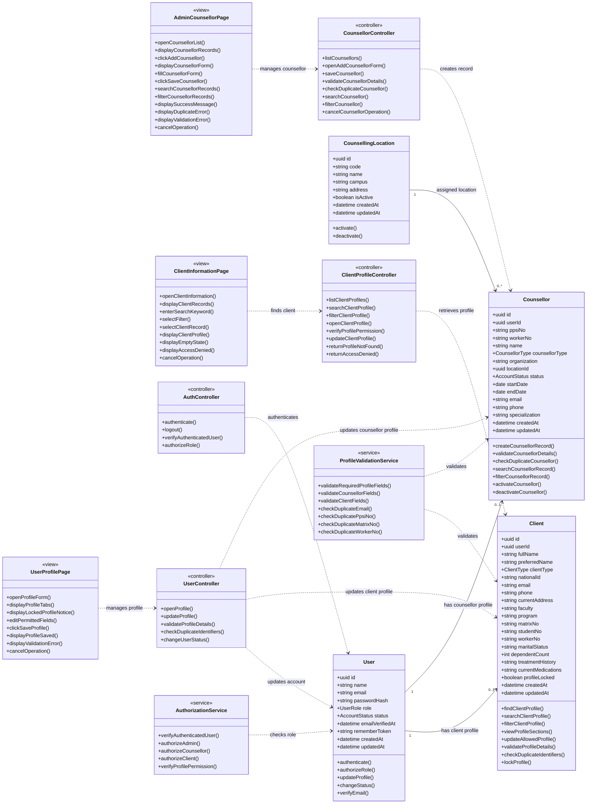
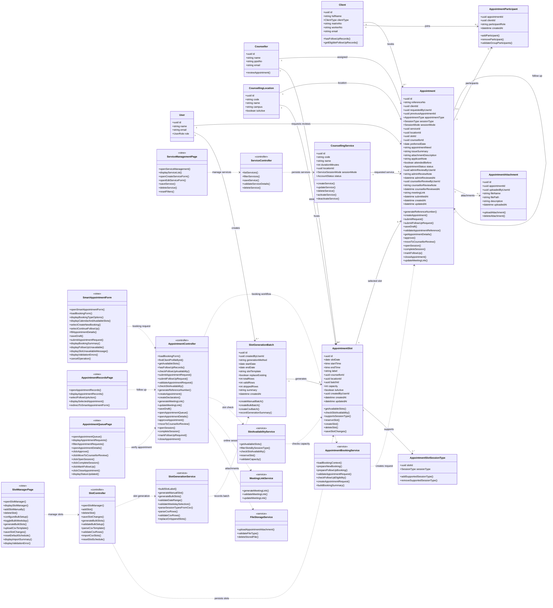
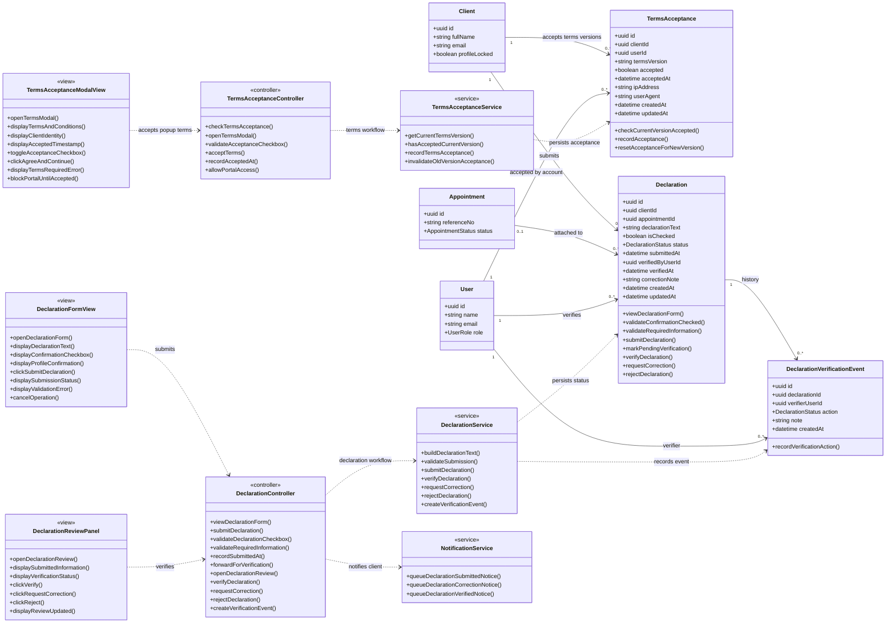
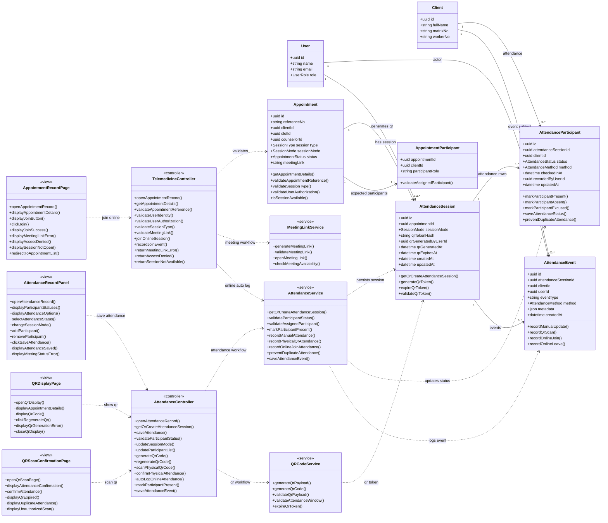
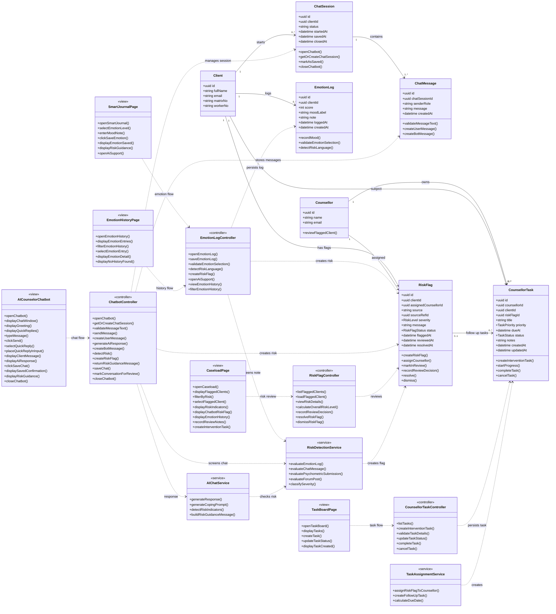
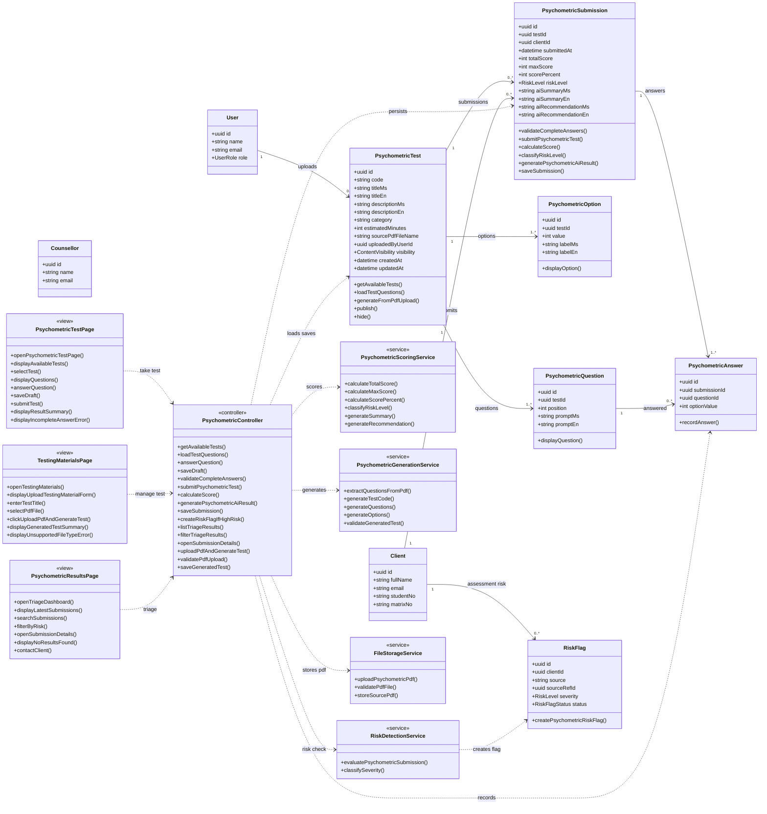
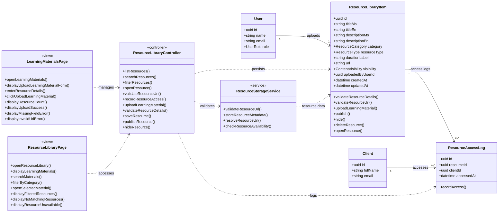
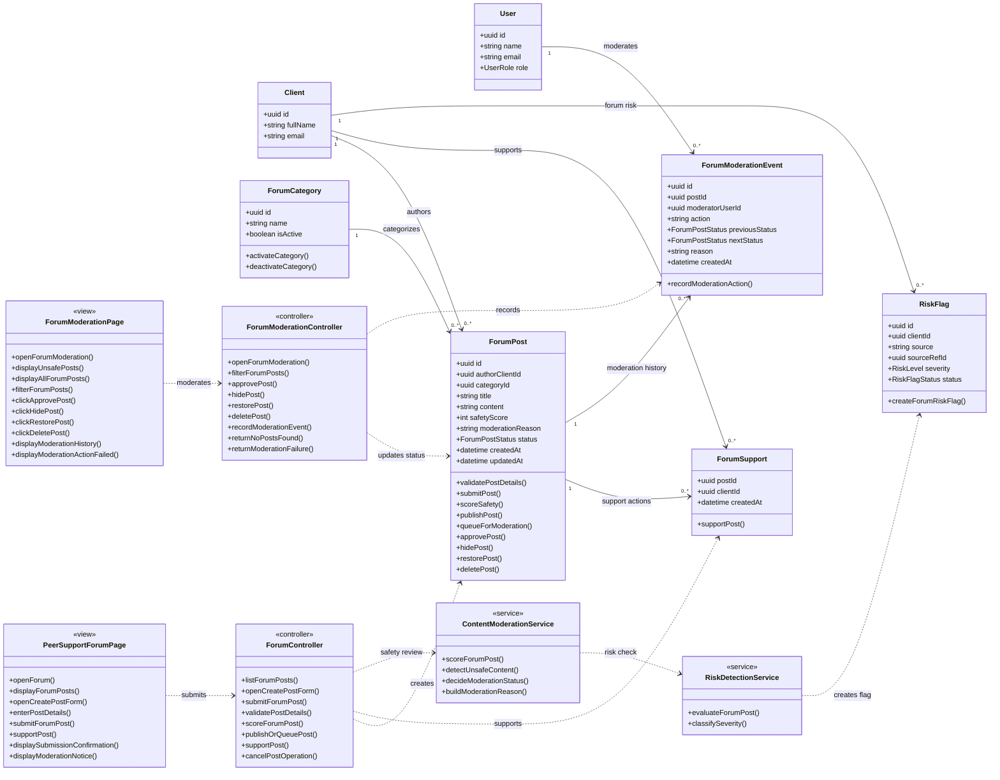
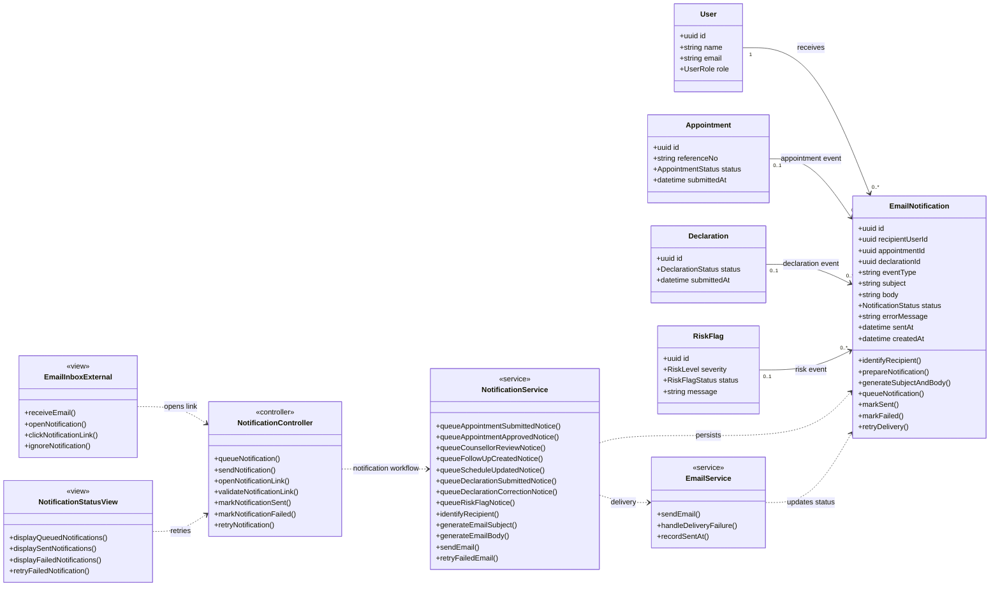

# PsyCare 2.0 Full Domain Class Diagram

This document defines the complete PsyCare 2.0 domain class model for the whole system. It is based on:

- `docs/use-cases.md`
- `docs/use-case-descriptions.md`
- `docs/postgresql-database-schema.md`
- `docs/architecture-diagram.md`
- Current Inertia React UI pages under `resources/js/pages`

The diagrams follow the intended Laravel MVC architecture:

- React/Inertia pages are shown as `<<view>>`.
- Laravel controllers are shown as `<<controller>>`.
- Domain/application services are shown as `<<service>>`.
- Supabase PostgreSQL tables are represented as domain model classes.

The diagrams are split by module so they remain readable and professional. Together, they cover every documented use case and the functions that should appear in sequence diagrams for those use cases.

## Complete Use Case Scope

| Module | Covered Use Cases |
| --- | --- |
| User Management | UM01 Onboard Counselor, UM02 Find Client Profile, UM03 Manage User Profile |
| Appointment and Scheduling | AS01 Book Appointment, AS02 Request Follow Up, AS03 Book New Appointment, AS04 Manage Slots, AS05 Bulk Generate Slots, AS06 Import CSV Template, AS07 Verify Appointment |
| Declaration | DC01 View Declaration Form, DC02 Submit Declaration, DC03 Verify Declaration |
| Telemedicine and Attendance | TA01 Join Online Session, TA02 Record Attendance, TA03 Scan Physical QR Code, TA04 Auto-log Attendance Online |
| Chatbot and Tracking | CT01 Log Daily Emotion, CT02 Chat with AI Counselor, CT03 View Emotion History, CT04 Investigate Flagged Client |
| Psychometric Self-Assessment | SA01 Take Psychometric Test, SA02 View Triage Dashboard, SA03 Manage Test |
| Educational Resource Library | ER01 Manage Resource Library, ER02 Access Learning Materials |
| Peer Support Forum | PS01 Submit Forum Post, PS02 Moderate Forum |
| Notifications | Notification events from declaration, appointment, forum, and risk workflows |

## Diagram 1: User Management Domain

## Diagram 2: Appointment And Scheduling Domain

## Diagram 3: Terms Acceptance And Declaration Domain

## Diagram 4: Telemedicine And Attendance Domain

## Diagram 5: Chatbot, Emotion Tracking, Risk, And Counsellor Tasks

## Diagram 6: Psychometric Self-Assessment Domain

## Diagram 7: Educational Resource Library Domain

## Diagram 8: Peer Support Forum Domain

## Diagram 9: Notification Domain

## Complete Sequence Function Coverage

This matrix shows the functions that should be available when generating sequence diagrams for any documented use case.

### User Management

| Use Case | View Functions | Controller Functions | Model / Service Functions |
| --- | --- | --- | --- |
| UM01 Onboard Counselor | `openCounsellorList()`, `displayCounsellorRecords()`, `clickAddCounsellor()`, `displayCounsellorForm()`, `fillCounsellorForm()`, `clickSaveCounsellor()`, `displaySuccessMessage()`, `displayDuplicateError()`, `cancelOperation()` | `listCounsellors()`, `openAddCounsellorForm()`, `saveCounsellor()`, `validateCounsellorDetails()`, `checkDuplicateCounsellor()`, `searchCounsellor()`, `filterCounsellor()` | `createCounsellorRecord()`, `validateCounsellorDetails()`, `checkDuplicateCounsellor()`, `verifyAuthenticatedUser()`, `authorizeAdmin()` |
| UM02 Find Client Profile | `openClientInformation()`, `displayClientRecords()`, `enterSearchKeyword()`, `selectFilter()`, `selectClientRecord()`, `displayClientProfile()`, `displayEmptyState()`, `displayAccessDenied()` | `listClientProfiles()`, `searchClientProfile()`, `filterClientProfile()`, `openClientProfile()`, `verifyProfilePermission()`, `returnProfileNotFound()`, `returnAccessDenied()` | `findClientProfile()`, `searchClientProfile()`, `filterClientProfile()`, `verifyProfilePermission()` |
| UM03 Manage User Profile | `openProfileForm()`, `displayProfileTabs()`, `displayLockedProfileNotice()`, `editPermittedFields()`, `clickSaveProfile()`, `displayProfileSaved()`, `displayValidationError()` | `openProfile()`, `updateProfile()`, `validateProfileDetails()`, `checkDuplicateIdentifiers()`, `changeUserStatus()` | `updateProfile()`, `updateAllowedProfile()`, `validateProfileDetails()`, `checkDuplicateIdentifiers()` |

### Appointment And Scheduling

| Use Case | View Functions | Controller Functions | Model / Service Functions |
| --- | --- | --- | --- |
| AS01 Book Appointment | `openSmartAppointmentForm()`, `loadBookingForm()`, `displayBookingTypeOptions()`, `displayCalendarAndAvailableSlots()`, `submitAppointmentRequest()`, `displayBookingSummary()`, `displaySlotUnavailableMessage()`, `displayValidationErrors()` | `loadBookingForm()`, `findClientProfileById()`, `getAvailableSlots()`, `submitAppointmentRequest()`, `validateAppointmentRequest()`, `checkSlotAvailability()`, `createAppointment()`, `createDeclaration()`, `generateMeetingLink()` | `loadBookingContext()`, `validateAppointmentRequest()`, `checkSlotAvailability()`, `generateReferenceNumber()`, `createAppointment()`, `createDeclaration()`, `generateMeetingLink()` |
| AS02 Request Follow Up | `selectContinueFollowUp()`, `openAppointmentRecords()`, `selectFollowUpAction()`, `redirectToSmartAppointmentForm()`, `displayFollowUpUnavailable()` | `hasFollowUpRecords()`, `checkFollowUpAvailability()`, `submitFollowUpRequest()` | `hasFollowUpRecords()`, `getEligibleFollowUpRecords()`, `prepareFollowUpBooking()`, `submitFollowUpRequest()` |
| AS03 Book New Appointment | `selectCreateNewBooking()`, `fillAppointmentDetails()`, `saveDraft()`, `submitAppointmentRequest()`, `cancelOperation()` | `generateReferenceNumber()`, `validateAppointmentRequest()`, `saveDraft()`, `submitAppointmentRequest()` | `prepareNewBooking()`, `saveDraft()`, `createAppointmentRequest()` |
| AS04 Manage Slots | `openSlotManager()`, `displaySlotManager()`, `addSlotManually()`, `deleteSlot()`, `saveSlotChanges()`, `resetDefaultSchedule()` | `openSlotManager()`, `addSlot()`, `deleteSlot()`, `saveSlotChanges()`, `resetSlotSchedule()` | `createSlot()`, `deleteSlot()`, `saveSlotChanges()`, `generateManualSlot()` |
| AS05 Bulk Generate Slots | `configureBulkSetup()`, `toggleBulkWeekday()`, `generateBulkSlots()`, `displayImportSummary()` | `generateBulkSlots()`, `validateBulkSetup()` | `generateBulkSlots()`, `validateDateRange()`, `validateWeekdaySelection()`, `replaceOrAppendSlots()`, `recordGenerationSummary()` |
| AS06 Import CSV Template | `uploadCsvTemplate()`, `displayImportSummary()`, `displayValidationError()` | `parseCsvTemplate()`, `validateCsvRows()`, `importCsvSlots()` | `parseCsvRows()`, `parseSessionTypesFromCsv()`, `validateCsvRows()`, `createCsvBatch()`, `replaceOrAppendSlots()` |
| AS07 Verify Appointment | `openAppointmentQueue()`, `displayAppointmentRequests()`, `filterAppointmentRequests()`, `openAppointmentDetails()`, `clickApprove()`, `clickMoveToCounsellorReview()`, `clickOpenSession()`, `clickCompleteSession()`, `clickMarkFollowUp()`, `clickCloseAppointment()` | `openAppointmentQueue()`, `openAppointmentDetails()`, `approveAppointment()`, `moveToCounsellorReview()`, `openSession()`, `completeSession()`, `markFollowUpRequired()`, `closeAppointment()` | `getAppointmentDetails()`, `approve()`, `moveToCounsellorReview()`, `openSession()`, `completeSession()`, `markFollowUp()`, `closeAppointment()` |

### Declaration

| Use Case | View Functions | Controller Functions | Model / Service Functions |
| --- | --- | --- | --- |
| DC01 View Declaration Form | `openDeclarationForm()`, `displayDeclarationText()`, `displayConfirmationCheckbox()`, `displayProfileConfirmation()` | `viewDeclarationForm()` | `viewDeclarationForm()`, `buildDeclarationText()` |
| DC02 Submit Declaration | `clickSubmitDeclaration()`, `displaySubmissionStatus()`, `displayValidationError()` | `submitDeclaration()`, `validateDeclarationCheckbox()`, `validateRequiredInformation()`, `recordSubmittedAt()`, `forwardForVerification()` | `validateSubmission()`, `submitDeclaration()`, `markPendingVerification()` |
| DC03 Verify Declaration | `openDeclarationReview()`, `displaySubmittedInformation()`, `clickVerify()`, `clickRequestCorrection()`, `clickReject()`, `displayReviewUpdated()` | `openDeclarationReview()`, `verifyDeclaration()`, `requestCorrection()`, `rejectDeclaration()`, `createVerificationEvent()` | `verifyDeclaration()`, `requestCorrection()`, `rejectDeclaration()`, `createVerificationEvent()`, `recordVerificationAction()` |

### Telemedicine And Attendance

| Use Case | View Functions | Controller Functions | Model / Service Functions |
| --- | --- | --- | --- |
| TA01 Join Online Session | `openAppointmentRecord()`, `displayAppointmentDetails()`, `displayJoinButton()`, `clickJoin()`, `displayJoinSuccess()`, `displayMeetingLinkError()`, `displayAccessDenied()`, `displaySessionNotOpen()` | `openAppointmentRecord()`, `getAppointmentDetails()`, `validateAppointmentReference()`, `validateUserIdentity()`, `validateUserAuthorization()`, `validateSessionType()`, `validateMeetingLink()`, `joinOnlineSession()`, `recordJoinEvent()` | `getAppointmentDetails()`, `validateAppointmentReference()`, `validateSessionType()`, `validateUserAuthorization()`, `validateMeetingLink()`, `openMeetingLink()`, `recordOnlineJoin()` |
| TA02 Record Attendance | `openAttendanceRecord()`, `displayParticipantStatuses()`, `displayAttendanceOptions()`, `selectAttendanceStatus()`, `changeSessionMode()`, `addParticipant()`, `removeParticipant()`, `clickSaveAttendance()`, `displayAttendanceSaved()` | `openAttendanceRecord()`, `getOrCreateAttendanceSession()`, `saveAttendance()`, `validateParticipantStatus()`, `updateSessionMode()`, `updateParticipantList()` | `getOrCreateAttendanceSession()`, `saveAttendanceStatus()`, `markParticipantPresent()`, `recordManualUpdate()`, `validateParticipantStatus()` |
| TA03 Scan Physical QR Code | `openQrScanPage()`, `displayAttendanceConfirmation()`, `confirmAttendance()`, `displayQrExpired()`, `displayDuplicateAttendance()`, `displayUnauthorizedScan()` | `scanPhysicalQrCode()`, `confirmPhysicalAttendance()`, `markParticipantPresent()`, `saveAttendanceEvent()` | `validateQrPayload()`, `validateAttendanceWindow()`, `validateAssignedParticipant()`, `preventDuplicateAttendance()`, `recordQrScan()` |
| TA04 Auto-log Attendance Online | `clickJoin()`, `displayJoinSuccess()` | `autoLogOnlineAttendance()`, `markParticipantPresent()`, `saveAttendanceEvent()` | `recordOnlineJoinAttendance()`, `preventDuplicateAttendance()`, `recordOnlineJoin()` |

### Chatbot And Tracking

| Use Case | View Functions | Controller Functions | Model / Service Functions |
| --- | --- | --- | --- |
| CT01 Log Daily Emotion | `openSmartJournal()`, `selectEmotionLevel()`, `enterMoodNote()`, `clickSaveEmotion()`, `displayEmotionSaved()`, `displayRiskGuidance()`, `openAiSupport()` | `openEmotionLog()`, `saveEmotionLog()`, `validateEmotionSelection()`, `detectRiskLanguage()`, `createRiskFlag()`, `openAiSupport()` | `recordMood()`, `validateEmotionSelection()`, `detectRiskLanguage()`, `evaluateEmotionLog()`, `createRiskFlag()` |
| CT02 Chat with AI Counselor | `openChatbot()`, `displayChatWindow()`, `displayQuickReplies()`, `typeMessage()`, `clickSend()`, `selectQuickReply()`, `displayClientMessage()`, `displayAiResponse()`, `clickSaveChat()`, `displaySavedConfirmation()`, `closeChatbot()` | `openChatbot()`, `getOrCreateChatSession()`, `validateMessageText()`, `sendMessage()`, `createUserMessage()`, `generateAiResponse()`, `createBotMessage()`, `detectRisk()`, `createRiskFlag()`, `saveChat()`, `markConversationForReview()`, `closeChatbot()` | `getOrCreateChatSession()`, `validateMessageText()`, `createUserMessage()`, `generateResponse()`, `createBotMessage()`, `detectRiskIndicators()`, `createRiskFlag()`, `markAsSaved()` |
| CT03 View Emotion History | `openEmotionHistory()`, `displayEmotionEntries()`, `filterEmotionHistory()`, `selectEmotionEntry()`, `displayEmotionDetail()`, `displayNoHistoryFound()` | `viewEmotionHistory()`, `filterEmotionHistory()` | `searchClientProfile()`, `recordMood()`, `evaluateEmotionLog()` |
| CT04 Investigate Flagged Client | `openCaseload()`, `displayFlaggedClients()`, `filterByRisk()`, `selectFlaggedClient()`, `displayRiskIndicators()`, `recordReviewNotes()`, `createInterventionTask()` | `listFlaggedClients()`, `loadFlaggedClient()`, `viewRiskDetails()`, `calculateOverallRiskLevel()`, `recordReviewDecision()`, `createInterventionTask()` | `markInReview()`, `recordReviewDecision()`, `resolve()`, `createInterventionTask()`, `assignRiskFlagToCounsellor()` |

### Psychometric Self-Assessment

| Use Case | View Functions | Controller Functions | Model / Service Functions |
| --- | --- | --- | --- |
| SA01 Take Psychometric Test | `openPsychometricTestPage()`, `displayAvailableTests()`, `selectTest()`, `displayQuestions()`, `answerQuestion()`, `saveDraft()`, `submitTest()`, `displayResultSummary()`, `displayIncompleteAnswerError()` | `getAvailableTests()`, `loadTestQuestions()`, `answerQuestion()`, `saveDraft()`, `validateCompleteAnswers()`, `submitPsychometricTest()`, `calculateScore()`, `generatePsychometricAiResult()`, `saveSubmission()`, `createRiskFlagIfHighRisk()` | `getAvailableTests()`, `loadTestQuestions()`, `recordAnswer()`, `validateCompleteAnswers()`, `calculateTotalScore()`, `calculateScorePercent()`, `classifyRiskLevel()`, `generateRecommendation()`, `saveSubmission()` |
| SA02 View Triage Dashboard | `openTriageDashboard()`, `displayLatestSubmissions()`, `searchSubmissions()`, `filterByRisk()`, `openSubmissionDetails()`, `displayNoResultsFound()`, `contactClient()` | `listTriageResults()`, `filterTriageResults()`, `openSubmissionDetails()` | `evaluatePsychometricSubmission()`, `classifyRiskLevel()` |
| SA03 Manage Test | `openTestingMaterials()`, `displayUploadTestingMaterialForm()`, `enterTestTitle()`, `selectPdfFile()`, `clickUploadPdfAndGenerateTest()`, `displayGeneratedTestSummary()`, `displayUnsupportedFileTypeError()` | `uploadPdfAndGenerateTest()`, `validatePdfUpload()`, `saveGeneratedTest()` | `uploadPsychometricPdf()`, `validatePdfFile()`, `extractQuestionsFromPdf()`, `generateTestCode()`, `generateQuestions()`, `generateOptions()`, `generateFromPdfUpload()` |

### Resource Library, Forum, And Notification

| Use Case | View Functions | Controller Functions | Model / Service Functions |
| --- | --- | --- | --- |
| ER01 Manage Resource Library | `openLearningMaterials()`, `displayUploadLearningMaterialForm()`, `enterResourceDetails()`, `clickUploadLearningMaterial()`, `displayResourceCount()`, `displayUploadSuccess()`, `displayMissingFieldError()`, `displayInvalidUrlError()` | `uploadLearningMaterial()`, `validateResourceDetails()`, `validateResourceUrl()`, `saveResource()` | `validateResourceDetails()`, `validateResourceUrl()`, `uploadLearningMaterial()`, `storeResourceMetadata()` |
| ER02 Access Learning Materials | `openResourceLibrary()`, `displayLearningMaterials()`, `searchMaterials()`, `filterByCategory()`, `openSelectedMaterial()`, `displayFilteredResources()`, `displayNoMatchingResources()`, `displayResourceUnavailable()` | `listResources()`, `searchResources()`, `filterResources()`, `openResource()`, `recordResourceAccess()` | `openResource()`, `checkResourceAvailability()`, `recordAccess()` |
| PS01 Submit Forum Post | `openForum()`, `displayForumPosts()`, `openCreatePostForm()`, `enterPostDetails()`, `submitForumPost()`, `supportPost()`, `displaySubmissionConfirmation()`, `displayModerationNotice()` | `listForumPosts()`, `openCreatePostForm()`, `submitForumPost()`, `validatePostDetails()`, `scoreForumPost()`, `publishOrQueuePost()`, `supportPost()` | `validatePostDetails()`, `submitPost()`, `scoreSafety()`, `queueForModeration()`, `publishPost()`, `supportPost()`, `evaluateForumPost()` |
| PS02 Moderate Forum | `openForumModeration()`, `displayUnsafePosts()`, `filterForumPosts()`, `clickApprovePost()`, `clickHidePost()`, `clickRestorePost()`, `clickDeletePost()`, `displayModerationHistory()` | `openForumModeration()`, `filterForumPosts()`, `approvePost()`, `hidePost()`, `restorePost()`, `deletePost()`, `recordModerationEvent()` | `approvePost()`, `hidePost()`, `restorePost()`, `deletePost()`, `recordModerationAction()` |

## Enum Reference

| Enum | Values |
| --- | --- |
| `UserRole` | `admin`, `client`, `counselor` |
| `AccountStatus` | `active`, `inactive`, `suspended` |
| `ClientType` | `student`, `staff`, `alumni` |
| `CounsellorType` | `staff`, `trainee` |
| `ServiceSessionMode` | `physical`, `online`, `hybrid` |
| `SessionType` | `physical`, `online` |
| `SessionMode` | `individual`, `group` |
| `AppointmentType` | `new`, `follow_up` |
| `AppointmentStatus` | `pending`, `needs_review`, `counsellor_reviewing`, `approved`, `on_going`, `complete`, `completed`, `follow_up`, `closed` |
| `AttendanceStatus` | `pending`, `present`, `absent`, `excused` |
| `AttendanceMethod` | `manual`, `physical_qr`, `online_auto` |
| `DeclarationStatus` | `draft`, `submitted`, `pending_verification`, `verified`, `correction_required`, `rejected` |
| `RiskLevel` | `low`, `moderate`, `high` |
| `RiskFlagStatus` | `open`, `in_review`, `resolved`, `dismissed` |
| `TaskPriority` | `low`, `medium`, `high` |
| `TaskStatus` | `open`, `in_progress`, `completed`, `cancelled` |
| `ResourceCategory` | `stress`, `anxiety`, `sleep`, `support` |
| `ResourceType` | `article`, `video`, `toolkit` |
| `ContentVisibility` | `draft`, `published`, `hidden`, `deleted` |
| `ForumPostStatus` | `pending_review`, `published`, `hidden`, `deleted` |
| `NotificationStatus` | `queued`, `sent`, `failed` |

## Drawing Guidance For Visual Paradigm

Draw these as separate package-level domain class diagrams:

1. `User Management`
2. `Appointment And Scheduling`
3. `Declaration`
4. `Telemedicine And Attendance`
5. `Chatbot Tracking And Risk`
6. `Psychometric Self-Assessment`
7. `Educational Resource Library`
8. `Peer Support Forum`
9. `Notification`

For each diagram:

- Put `<<view>>` classes on the left.
- Put `<<controller>>` classes in the middle.
- Put `<<service>>` classes after controllers.
- Put model/domain classes on the right.
- Draw View to Controller dependencies as dashed dependencies.
- Draw Controller to Service dependencies as dashed dependencies.
- Draw Service to Model dependencies as dashed dependencies.
- Draw Model to Model relationships with multiplicities.
- Keep Supabase PostgreSQL out of the class diagram itself. Supabase belongs in the architecture/component diagram, while these model classes represent the domain data stored in Supabase.
