# PsyCare 2.0 Entity Relationship Diagram

This ERD is aligned with the latest 32 `<<Model>>` classes in:

- `docs/SRS class diagram.md`
- `docs/SRS class diagram plantuml.md`
- `docs/entity-data-dictionary.md`
- `docs/postgresql-database-schema.md`

The diagram uses PlantUML entity notation. Entity names follow the latest SRS model class names, while attributes and data types follow the documented Supabase PostgreSQL schema.

## Scope

This ERD includes the 32 current model entities only:

1. UserAccount
2. ClientProfile
3. Counsellor
4. CounsellingLocation
5. Appointment
6. AppointmentSlot
7. AppointmentSlotSessionType
8. AppointmentAttachment
9. AppointmentParticipant
10. SlotGenerationBatch
11. EmailNotification
12. Declaration
13. DeclarationVerificationEvent
14. AttendanceSession
15. AttendanceParticipant
16. AttendanceEvent
17. EmotionLog
18. ChatSession
19. ChatMessage
20. RiskFlag
21. CounsellorTask
22. ResourceLibraryItem
23. ResourceAccessLog
24. ForumCategory
25. ForumPost
26. ForumSupport
27. ForumModerationEvent
28. PsychometricTest
29. PsychometricQuestion
30. PsychometricOption
31. PsychometricSubmission
32. PsychometricAnswer

## Adjustment Log

The previous ERD document included schema tables that are not part of the latest 32-model class diagram. I adjusted the ERD scope as follows:

| Item | Adjustment | Reason |
| --- | --- | --- |
| `terms_acceptances` | Removed from the main ERD. | It exists in the Supabase schema, but it is not one of the latest 32 `<<Model>>` classes. |
| `counselling_services` | Removed from the main ERD. | It exists in the Supabase schema, but it is not one of the latest 32 `<<Model>>` classes. `Appointment.service_id` is retained as a schema-level FK attribute. |
| Laravel runtime tables | Removed from the main ERD. | Tables such as `migrations`, `sessions`, `cache`, and `jobs` are infrastructure tables, not PsyCare SRS domain models. |

No change was made to the Supabase schema document. This ERD is a 32-model SRS ERD, not a full physical database ERD for every table in Supabase.

## Multiplicity Legend

| Multiplicity | Meaning |
| --- | --- |
| `1` | Exactly one related record is required. |
| `0..1` | The related record is optional and at most one can exist. |
| `0..*` | Zero or many related records can exist. |
| `1..*` | One or many related records are expected. |

## ERD: 32 Model Entities

```plantuml
@startuml
scale max 5000 width
top to bottom direction
hide circle
skinparam linetype ortho
skinparam classAttributeIconSize 0
skinparam shadowing false

entity "UserAccount\n(users)" as UserAccount {
  * id : uuid [PK]
  --
  name : text
  email : text [UK]
  password_hash : text
  role : user_role
  status : account_status
  email_verified_at : timestamptz
  remember_token : text
  created_at : timestamptz
  updated_at : timestamptz
}

entity "ClientProfile\n(clients)" as ClientProfile {
  * id : uuid [PK]
  --
  user_id : uuid [FK, UK]
  full_name : text
  preferred_name : text
  client_type : client_type
  national_id : text [UK]
  email : text [UK]
  phone : text
  current_address : text
  faculty : text
  program : text
  matrix_no : text [UK]
  student_no : text [UK]
  worker_no : text [UK]
  marital_status : text
  dependent_count : integer
  treatment_history : text
  current_medications : text
  profile_locked : boolean
  created_at : timestamptz
  updated_at : timestamptz
}

entity "Counsellor\n(counsellors)" as Counsellor {
  * id : uuid [PK]
  --
  user_id : uuid [FK, UK]
  ppsi_no : text [UK]
  worker_no : text [UK]
  name : text
  counsellor_type : counsellor_type
  organization : text
  location_id : uuid [FK]
  status : account_status
  start_date : date
  end_date : date
  email : text [UK]
  phone : text
  specialization : text
  created_at : timestamptz
  updated_at : timestamptz
}

entity "CounsellingLocation\n(counselling_locations)" as CounsellingLocation {
  * id : uuid [PK]
  --
  code : text [UK]
  name : text
  campus : text
  address : text
  is_active : boolean
  created_at : timestamptz
  updated_at : timestamptz
}

entity "Appointment\n(appointments)" as Appointment {
  * id : uuid [PK]
  --
  reference_no : text [UK]
  client_id : uuid [FK]
  requested_by_user_id : uuid [FK]
  previous_appointment_id : uuid [FK]
  appointment_type : appointment_type
  session_type : session_type
  session_mode : session_mode
  service_id : uuid [FK]
  location_id : uuid [FK]
  slot_id : uuid [FK]
  counsellor_id : uuid [FK]
  preferred_date : date
  appointment_need : text
  issue_summary : text
  attachment_description : text
  applicant_note : text
  attended_before : boolean
  status : appointment_status
  admin_review_by_user_id : uuid [FK]
  admin_review_note : text
  admin_reviewed_at : timestamptz
  counsellor_review_by_user_id : uuid [FK]
  counsellor_review_note : text
  counsellor_reviewed_at : timestamptz
  meeting_link : text
  submitted_at : timestamptz
  created_at : timestamptz
  updated_at : timestamptz
}

entity "AppointmentSlot\n(appointment_slots)" as AppointmentSlot {
  * id : uuid [PK]
  --
  slot_date : date
  start_time : time
  end_time : time
  label : text
  counsellor_id : uuid [FK]
  location_id : uuid [FK]
  batch_id : uuid [FK]
  capacity : integer
  is_active : boolean
  created_by_user_id : uuid [FK]
  created_at : timestamptz
  updated_at : timestamptz
}

entity "AppointmentSlotSessionType\n(appointment_slot_session_types)" as AppointmentSlotSessionType {
  * slot_id : uuid [PK, FK]
  * session_type : session_type [PK]
}

entity "AppointmentAttachment\n(appointment_attachments)" as AppointmentAttachment {
  * id : uuid [PK]
  --
  appointment_id : uuid [FK]
  uploaded_by_user_id : uuid [FK]
  file_name : text
  file_path : text
  description : text
  uploaded_at : timestamptz
}

entity "AppointmentParticipant\n(appointment_participants)" as AppointmentParticipant {
  * appointment_id : uuid [PK, FK]
  * client_id : uuid [PK, FK]
  --
  participant_role : text
  created_at : timestamptz
}

entity "SlotGenerationBatch\n(slot_generation_batches)" as SlotGenerationBatch {
  * id : uuid [PK]
  --
  created_by_user_id : uuid [FK]
  generation_method : text
  start_date : date
  end_date : date
  slot_template : text
  replace_existing : boolean
  total_rows : integer
  valid_rows : integer
  skipped_rows : integer
  summary : text
  created_at : timestamptz
}

entity "EmailNotification\n(email_notifications)" as EmailNotification {
  * id : uuid [PK]
  --
  recipient_user_id : uuid [FK]
  appointment_id : uuid [FK]
  declaration_id : uuid [FK]
  event_type : text
  subject : text
  body : text
  status : notification_status
  error_message : text
  sent_at : timestamptz
  created_at : timestamptz
}

entity "Declaration\n(declarations)" as Declaration {
  * id : uuid [PK]
  --
  client_id : uuid [FK]
  appointment_id : uuid [FK]
  declaration_text : text
  is_checked : boolean
  status : declaration_status
  submitted_at : timestamptz
  verified_by_user_id : uuid [FK]
  verified_at : timestamptz
  correction_note : text
  created_at : timestamptz
  updated_at : timestamptz
}

entity "DeclarationVerificationEvent\n(declaration_verification_events)" as DeclarationVerificationEvent {
  * id : uuid [PK]
  --
  declaration_id : uuid [FK]
  verifier_user_id : uuid [FK]
  action : declaration_status
  note : text
  created_at : timestamptz
}

entity "AttendanceSession\n(attendance_sessions)" as AttendanceSession {
  * id : uuid [PK]
  --
  appointment_id : uuid [FK, UK]
  session_mode : session_mode
  qr_token_hash : text
  qr_generated_by_user_id : uuid [FK]
  qr_generated_at : timestamptz
  qr_expires_at : timestamptz
  created_at : timestamptz
  updated_at : timestamptz
}

entity "AttendanceParticipant\n(attendance_participants)" as AttendanceParticipant {
  * id : uuid [PK]
  --
  attendance_session_id : uuid [FK]
  client_id : uuid [FK]
  status : attendance_status
  method : attendance_method
  checked_in_at : timestamptz
  recorded_by_user_id : uuid [FK]
  updated_at : timestamptz
}

entity "AttendanceEvent\n(attendance_events)" as AttendanceEvent {
  * id : uuid [PK]
  --
  attendance_session_id : uuid [FK]
  client_id : uuid [FK]
  user_id : uuid [FK]
  event_type : text
  method : attendance_method
  metadata : jsonb
  created_at : timestamptz
}

entity "EmotionLog\n(emotion_logs)" as EmotionLog {
  * id : uuid [PK]
  --
  client_id : uuid [FK]
  score : integer
  mood_label : text
  note : text
  logged_at : timestamptz
  created_at : timestamptz
}

entity "ChatSession\n(chat_sessions)" as ChatSession {
  * id : uuid [PK]
  --
  client_id : uuid [FK]
  status : text
  started_at : timestamptz
  saved_at : timestamptz
  closed_at : timestamptz
}

entity "ChatMessage\n(chat_messages)" as ChatMessage {
  * id : uuid [PK]
  --
  chat_session_id : uuid [FK]
  sender_role : text
  message : text
  created_at : timestamptz
}

entity "RiskFlag\n(risk_flags)" as RiskFlag {
  * id : uuid [PK]
  --
  client_id : uuid [FK]
  assigned_counsellor_id : uuid [FK]
  source : text
  source_ref_id : uuid
  severity : risk_level
  message : text
  status : risk_flag_status
  flagged_at : timestamptz
  reviewed_by_user_id : uuid [FK]
  review_note : text
  reviewed_at : timestamptz
  resolved_at : timestamptz
}

entity "CounsellorTask\n(counsellor_tasks)" as CounsellorTask {
  * id : uuid [PK]
  --
  counsellor_id : uuid [FK]
  client_id : uuid [FK]
  risk_flag_id : uuid [FK]
  title : text
  priority : task_priority
  due_at : timestamptz
  status : task_status
  notes : text
  created_at : timestamptz
  updated_at : timestamptz
}

entity "ResourceLibraryItem\n(resource_library_items)" as ResourceLibraryItem {
  * id : uuid [PK]
  --
  title_ms : text
  title_en : text
  description_ms : text
  description_en : text
  category : resource_category
  resource_type : resource_type
  duration_label : text
  url : text
  visibility : content_visibility
  uploaded_by_user_id : uuid [FK]
  created_at : timestamptz
  updated_at : timestamptz
}

entity "ResourceAccessLog\n(resource_access_logs)" as ResourceAccessLog {
  * id : uuid [PK]
  --
  resource_id : uuid [FK]
  client_id : uuid [FK]
  accessed_at : timestamptz
}

entity "ForumCategory\n(forum_categories)" as ForumCategory {
  * id : uuid [PK]
  --
  name : text [UK]
  is_active : boolean
}

entity "ForumPost\n(forum_posts)" as ForumPost {
  * id : uuid [PK]
  --
  author_client_id : uuid [FK]
  category_id : uuid [FK]
  title : text
  content : text
  safety_score : integer
  moderation_reason : text
  status : forum_post_status
  created_at : timestamptz
  updated_at : timestamptz
}

entity "ForumSupport\n(forum_supports)" as ForumSupport {
  * post_id : uuid [PK, FK]
  * client_id : uuid [PK, FK]
  --
  created_at : timestamptz
}

entity "ForumModerationEvent\n(forum_moderation_events)" as ForumModerationEvent {
  * id : uuid [PK]
  --
  post_id : uuid [FK]
  moderator_user_id : uuid [FK]
  action : text
  previous_status : forum_post_status
  next_status : forum_post_status
  reason : text
  created_at : timestamptz
}

entity "PsychometricTest\n(psychometric_tests)" as PsychometricTest {
  * id : uuid [PK]
  --
  code : text [UK]
  title_ms : text
  title_en : text
  description_ms : text
  description_en : text
  category : text
  estimated_minutes : integer
  source_pdf_file_name : text
  uploaded_by_user_id : uuid [FK]
  visibility : content_visibility
  created_at : timestamptz
  updated_at : timestamptz
}

entity "PsychometricQuestion\n(psychometric_questions)" as PsychometricQuestion {
  * id : uuid [PK]
  --
  test_id : uuid [FK]
  position : integer
  prompt_ms : text
  prompt_en : text
}

entity "PsychometricOption\n(psychometric_options)" as PsychometricOption {
  * id : uuid [PK]
  --
  test_id : uuid [FK]
  value : integer
  label_ms : text
  label_en : text
}

entity "PsychometricSubmission\n(psychometric_submissions)" as PsychometricSubmission {
  * id : uuid [PK]
  --
  test_id : uuid [FK]
  client_id : uuid [FK]
  submitted_at : timestamptz
  total_score : integer
  max_score : integer
  score_percent : integer
  risk_level : risk_level
  ai_summary_ms : text
  ai_summary_en : text
  ai_recommendation_ms : text
  ai_recommendation_en : text
}

entity "PsychometricAnswer\n(psychometric_answers)" as PsychometricAnswer {
  * id : uuid [PK]
  --
  submission_id : uuid [FK]
  question_id : uuid [FK]
  option_value : integer
}

UserAccount "0..1" -- "0..1" ClientProfile : has client profile
UserAccount "0..1" -- "0..1" Counsellor : has counsellor profile
CounsellingLocation "0..1" -- "0..*" Counsellor : assigned location

UserAccount "0..1" -- "0..*" SlotGenerationBatch : creates batch
SlotGenerationBatch "0..1" -- "0..*" AppointmentSlot : creates slots
Counsellor "0..1" -- "0..*" AppointmentSlot : owns slots
CounsellingLocation "0..1" -- "0..*" AppointmentSlot : hosts slots
UserAccount "0..1" -- "0..*" AppointmentSlot : creates slots
AppointmentSlot "1" -- "0..*" AppointmentSlotSessionType : supports session type

ClientProfile "0..1" -- "0..*" Appointment : books
UserAccount "0..1" -- "0..*" Appointment : requested by
Appointment "0..1" -- "0..*" Appointment : follow up of
AppointmentSlot "0..1" -- "0..*" Appointment : selected slot
CounsellingLocation "0..1" -- "0..*" Appointment : appointment location
Counsellor "0..1" -- "0..*" Appointment : assigned counsellor
UserAccount "0..1" -- "0..*" Appointment : admin review
UserAccount "0..1" -- "0..*" Appointment : counsellor review

Appointment "1" -- "0..*" AppointmentParticipant : has participants
ClientProfile "1" -- "0..*" AppointmentParticipant : participates
Appointment "1" -- "0..*" AppointmentAttachment : has attachments
UserAccount "0..1" -- "0..*" AppointmentAttachment : uploads attachment

ClientProfile "1" -- "0..*" Declaration : submits
Appointment "0..1" -- "0..*" Declaration : attached declaration
UserAccount "0..1" -- "0..*" Declaration : verifies declaration
Declaration "1" -- "0..*" DeclarationVerificationEvent : verification history
UserAccount "0..1" -- "0..*" DeclarationVerificationEvent : verifier

Appointment "1" -- "0..1" AttendanceSession : attendance session
UserAccount "0..1" -- "0..*" AttendanceSession : generates qr
AttendanceSession "1" -- "0..*" AttendanceParticipant : includes
ClientProfile "1" -- "0..*" AttendanceParticipant : attendance record
UserAccount "0..1" -- "0..*" AttendanceParticipant : records attendance
AttendanceSession "1" -- "0..*" AttendanceEvent : logs events
ClientProfile "0..1" -- "0..*" AttendanceEvent : client event
UserAccount "0..1" -- "0..*" AttendanceEvent : user event

ClientProfile "1" -- "0..*" EmotionLog : records emotion
ClientProfile "1" -- "0..*" ChatSession : starts chat
ChatSession "1" -- "0..*" ChatMessage : contains message
ClientProfile "1" -- "0..*" RiskFlag : flagged client
Counsellor "0..1" -- "0..*" RiskFlag : assigned counsellor
UserAccount "0..1" -- "0..*" RiskFlag : reviewed by
Counsellor "1" -- "0..*" CounsellorTask : owns task
ClientProfile "0..1" -- "0..*" CounsellorTask : task subject
RiskFlag "0..1" -- "0..*" CounsellorTask : related task

UserAccount "0..1" -- "0..*" ResourceLibraryItem : uploads resource
ResourceLibraryItem "1" -- "0..*" ResourceAccessLog : access history
ClientProfile "0..1" -- "0..*" ResourceAccessLog : opens resource

ForumCategory "0..1" -- "0..*" ForumPost : categorizes
ClientProfile "0..1" -- "0..*" ForumPost : authors
ForumPost "1" -- "0..*" ForumSupport : receives support
ClientProfile "1" -- "0..*" ForumSupport : supports post
ForumPost "1" -- "0..*" ForumModerationEvent : moderation history
UserAccount "0..1" -- "0..*" ForumModerationEvent : moderates

UserAccount "0..1" -- "0..*" PsychometricTest : uploads test
PsychometricTest "1" -- "0..*" PsychometricQuestion : has questions
PsychometricTest "0..1" -- "0..*" PsychometricOption : has options
PsychometricTest "1" -- "0..*" PsychometricSubmission : receives submission
ClientProfile "0..1" -- "0..*" PsychometricSubmission : submits test
PsychometricSubmission "1" -- "0..*" PsychometricAnswer : has answers
PsychometricQuestion "1" -- "0..*" PsychometricAnswer : answered question

UserAccount "0..1" -- "0..*" EmailNotification : receives notification
Appointment "0..1" -- "0..*" EmailNotification : appointment notice
Declaration "0..1" -- "0..*" EmailNotification : declaration notice
@enduml
```

## Supabase Table Mapping

| Model Entity | Supabase Table |
| --- | --- |
| UserAccount | `users` |
| ClientProfile | `clients` |
| Counsellor | `counsellors` |
| CounsellingLocation | `counselling_locations` |
| Appointment | `appointments` |
| AppointmentSlot | `appointment_slots` |
| AppointmentSlotSessionType | `appointment_slot_session_types` |
| AppointmentAttachment | `appointment_attachments` |
| AppointmentParticipant | `appointment_participants` |
| SlotGenerationBatch | `slot_generation_batches` |
| EmailNotification | `email_notifications` |
| Declaration | `declarations` |
| DeclarationVerificationEvent | `declaration_verification_events` |
| AttendanceSession | `attendance_sessions` |
| AttendanceParticipant | `attendance_participants` |
| AttendanceEvent | `attendance_events` |
| EmotionLog | `emotion_logs` |
| ChatSession | `chat_sessions` |
| ChatMessage | `chat_messages` |
| RiskFlag | `risk_flags` |
| CounsellorTask | `counsellor_tasks` |
| ResourceLibraryItem | `resource_library_items` |
| ResourceAccessLog | `resource_access_logs` |
| ForumCategory | `forum_categories` |
| ForumPost | `forum_posts` |
| ForumSupport | `forum_supports` |
| ForumModerationEvent | `forum_moderation_events` |
| PsychometricTest | `psychometric_tests` |
| PsychometricQuestion | `psychometric_questions` |
| PsychometricOption | `psychometric_options` |
| PsychometricSubmission | `psychometric_submissions` |
| PsychometricAnswer | `psychometric_answers` |

## Schema-Level Notes

- `Appointment.service_id` is kept because it exists in the documented Supabase schema. Its referenced table, `counselling_services`, is not drawn because it is not part of the latest 32-model class diagram.
- `terms_acceptances` exists in the documented Supabase schema, but it is not drawn because `TermsAcceptance` is no longer part of the latest 32-model class diagram.
- `RiskFlag.source_ref_id` is intentionally generic. It may refer to an `EmotionLog`, `ChatSession`, `PsychometricSubmission`, or `ForumPost` depending on `RiskFlag.source`, but this is not enforced as a direct PostgreSQL foreign key.
- Several relationships use `0..1` on the parent side because the current Supabase schema allows the foreign key field to be nullable, usually with `ON DELETE SET NULL`.
