# Figure 4.14 Page Navigation Design for PsyCare 2.0

This page navigation design is based on the current Laravel Inertia routes in `routes/web.php` and the UI pages under `resources/js/pages`.

## Hierarchical Navigation Diagram

```mermaid
flowchart TD
    ROOT["Root<br/>/"]
    ROOT --> PSYCARE_ENTRY["Client Portal Entry<br/>/psycare"]
    ROOT --> ADMIN_ENTRY["Admin Portal Entry<br/>/admin"]
    ROOT --> COUNSELLOR_ENTRY["Counsellor Portal Entry<br/>/counsellor"]

    PSYCARE_ENTRY --> CLIENT_DASHBOARD["Client Dashboard<br/>/psycare/dashboard"]
    ADMIN_ENTRY --> ADMIN_DASHBOARD["Admin Dashboard<br/>/admin/dashboard"]
    COUNSELLOR_ENTRY --> COUNSELLOR_DASHBOARD["Counsellor Dashboard<br/>/counsellor/dashboard"]

    subgraph CLIENT_PORTAL["Client Portal Navigation"]
        CLIENT_DASHBOARD --> SMART_APPOINTMENT["Smart Appointment Form<br/>/psycare/permohonan"]
        CLIENT_DASHBOARD --> APPOINTMENT_RECORDS["Appointment Records<br/>/psycare/rekod-temujanji"]
        CLIENT_DASHBOARD --> PSYCHOMETRIC_TEST["Psychometric Test<br/>/psycare/ujian-psikometrik"]
        CLIENT_DASHBOARD --> RESOURCE_LIBRARY["Resource Library<br/>/psycare/resource-library"]
        CLIENT_DASHBOARD --> SERVICES["Services<br/>/psycare/perkhidmatan"]
        CLIENT_DASHBOARD --> SMART_JOURNAL["Smart Journal<br/>/psycare/jurnal-pintar"]
        CLIENT_DASHBOARD --> PEER_FORUM["Peer Support Forum<br/>/psycare/forum-sokongan"]

        SMART_APPOINTMENT --> NEW_BOOKING["Create New Booking"]
        SMART_APPOINTMENT --> FOLLOW_UP_BOOKING["Continue Follow Up"]
        SMART_APPOINTMENT --> BOOKING_SUMMARY["Booking Summary"]

        APPOINTMENT_RECORDS --> FOLLOW_UP_ACTION["Follow-up Action"]
        APPOINTMENT_RECORDS --> ONLINE_JOIN["Join Online Session"]
        FOLLOW_UP_ACTION --> SMART_APPOINTMENT

        PSYCHOMETRIC_TEST --> TEST_SELECTION["Select Test"]
        PSYCHOMETRIC_TEST --> TEST_RESULT_HISTORY["Result History"]

        RESOURCE_LIBRARY --> OPEN_RESOURCE["Open Learning Material"]
        SMART_JOURNAL --> EMOTION_LOG["Daily Emotion Log"]
        SMART_JOURNAL --> AI_CHATBOT["AI Counselor Chatbot"]
        PEER_FORUM --> SUBMIT_FORUM_POST["Submit Forum Post"]
    end

    subgraph ADMIN_PORTAL["Admin Portal Navigation"]
        ADMIN_DASHBOARD --> SERVICE_MANAGEMENT["Service Management<br/>/admin/service"]
        ADMIN_DASHBOARD --> COUNSELLOR_PPSI["Counsellor PPsi Management<br/>/admin/counsellor-ppsi"]
        ADMIN_DASHBOARD --> COUNSELLOR_TIMETABLE["Counsellor Timetable<br/>/admin/counsellor-timetable"]
        ADMIN_DASHBOARD --> CLIENT_INFORMATION["Client Information<br/>/admin/client-information"]
        ADMIN_DASHBOARD --> APPOINTMENT_QUEUE["Appointment Queue<br/>/admin/appointments"]
        ADMIN_DASHBOARD --> TESTING_MATERIALS["Testing Materials<br/>/admin/materials"]
        ADMIN_DASHBOARD --> LEARNING_MATERIALS["Learning Materials<br/>/admin/learning-materials"]
        ADMIN_DASHBOARD --> FORUM_MODERATION["Forum Moderation<br/>/admin/forum"]

        SERVICE_MANAGEMENT --> ADD_EDIT_SERVICE["Add or Edit Service"]
        COUNSELLOR_PPSI --> ADD_EDIT_COUNSELLOR["Add or Edit Counsellor"]
        CLIENT_INFORMATION --> CLIENT_PROFILE_DETAIL["Client Profile Detail"]
        CLIENT_INFORMATION --> SESSION_RECORDS["Client Session Records"]
        APPOINTMENT_QUEUE --> REVIEW_APPOINTMENT["Review Appointment"]
        APPOINTMENT_QUEUE --> APPROVE_APPOINTMENT["Approve or Move to Review"]
        APPOINTMENT_QUEUE --> ADMIN_ATTENDANCE["Attendance Panel"]
        TESTING_MATERIALS --> UPLOAD_TEST_PDF["Upload PDF and Generate Test"]
        LEARNING_MATERIALS --> UPLOAD_RESOURCE["Upload Learning Material"]
        FORUM_MODERATION --> MODERATE_POST["Approve Hide Restore or Delete Post"]
    end

    subgraph COUNSELLOR_PORTAL["Counsellor Portal Navigation"]
        COUNSELLOR_DASHBOARD --> COUNSELLOR_APPOINTMENTS["Appointments<br/>/counsellor/appointments"]
        COUNSELLOR_DASHBOARD --> SLOT_MANAGER["Slot Manager<br/>/counsellor/slots"]
        COUNSELLOR_DASHBOARD --> CASELOAD["Caseload<br/>/counsellor/caseload"]
        COUNSELLOR_DASHBOARD --> TASKS["Tasks<br/>/counsellor/tasks"]
        COUNSELLOR_DASHBOARD --> PSYCHOMETRIC_RESULTS["Psychometric Results<br/>/counsellor/assessments"]

        COUNSELLOR_APPOINTMENTS --> REVIEW_ASSIGNED_APPOINTMENT["Review Assigned Appointment"]
        COUNSELLOR_APPOINTMENTS --> COUNSELLOR_ATTENDANCE["Attendance Panel"]
        COUNSELLOR_APPOINTMENTS --> SESSION_REPORT["Session Report Modal"]
        SLOT_MANAGER --> MANUAL_SLOT["Manual Slot Setup"]
        SLOT_MANAGER --> BULK_SLOT["Bulk Generate Slots"]
        SLOT_MANAGER --> CSV_SLOT["Import CSV Template"]
        CASELOAD --> FLAGGED_CLIENT_DETAIL["Flagged Client Detail"]
        CASELOAD --> RISK_REVIEW["Risk Review"]
        TASKS --> CREATE_TASK["Create Follow-up Task"]
        PSYCHOMETRIC_RESULTS --> TRIAGE_DETAIL["Triage Result Detail"]
    end

    classDef entry fill:#eef2ff,stroke:#4f46e5,color:#111827
    classDef client fill:#ecfdf5,stroke:#059669,color:#111827
    classDef admin fill:#fff7ed,stroke:#ea580c,color:#111827
    classDef counsellor fill:#eff6ff,stroke:#2563eb,color:#111827
    classDef action fill:#f9fafb,stroke:#6b7280,color:#111827

    class ROOT,PSYCARE_ENTRY,ADMIN_ENTRY,COUNSELLOR_ENTRY entry
    class CLIENT_DASHBOARD,SMART_APPOINTMENT,APPOINTMENT_RECORDS,PSYCHOMETRIC_TEST,RESOURCE_LIBRARY,SERVICES,SMART_JOURNAL,PEER_FORUM client
    class ADMIN_DASHBOARD,SERVICE_MANAGEMENT,COUNSELLOR_PPSI,COUNSELLOR_TIMETABLE,CLIENT_INFORMATION,APPOINTMENT_QUEUE,TESTING_MATERIALS,LEARNING_MATERIALS,FORUM_MODERATION admin
    class COUNSELLOR_DASHBOARD,COUNSELLOR_APPOINTMENTS,SLOT_MANAGER,CASELOAD,TASKS,PSYCHOMETRIC_RESULTS counsellor
    class NEW_BOOKING,FOLLOW_UP_BOOKING,BOOKING_SUMMARY,FOLLOW_UP_ACTION,ONLINE_JOIN,TEST_SELECTION,TEST_RESULT_HISTORY,OPEN_RESOURCE,EMOTION_LOG,AI_CHATBOT,SUBMIT_FORUM_POST,ADD_EDIT_SERVICE,ADD_EDIT_COUNSELLOR,CLIENT_PROFILE_DETAIL,SESSION_RECORDS,REVIEW_APPOINTMENT,APPROVE_APPOINTMENT,ADMIN_ATTENDANCE,UPLOAD_TEST_PDF,UPLOAD_RESOURCE,MODERATE_POST,REVIEW_ASSIGNED_APPOINTMENT,COUNSELLOR_ATTENDANCE,SESSION_REPORT,MANUAL_SLOT,BULK_SLOT,CSV_SLOT,FLAGGED_CLIENT_DETAIL,RISK_REVIEW,CREATE_TASK,TRIAGE_DETAIL action
```

## Navigation Hierarchy

### Root And Portal Entry

- `/` redirects to `/psycare`.
- `/psycare` redirects to `/psycare/dashboard`.
- `/admin` redirects to `/admin/dashboard`.
- `/counsellor` redirects to `/counsellor/dashboard`.

### Client Portal

| Level | Page / Function | Route |
| --- | --- | --- |
| 1 | Client Dashboard | `/psycare/dashboard` |
| 2 | Smart Appointment Form | `/psycare/permohonan` |
| 3 | Create New Booking | In-page function |
| 3 | Continue Follow Up | In-page function, may redirect to Appointment Records |
| 3 | Booking Summary | In-page result |
| 2 | Appointment Records | `/psycare/rekod-temujanji` |
| 3 | Follow-up Action | In-page action, returns to Smart Appointment Form |
| 3 | Join Online Session | In-page action using meeting link |
| 2 | Psychometric Test | `/psycare/ujian-psikometrik` |
| 3 | Select Test | In-page function |
| 3 | Result History | In-page section |
| 2 | Resource Library | `/psycare/resource-library` |
| 3 | Open Learning Material | External or stored resource URL |
| 2 | Services | `/psycare/perkhidmatan` |
| 2 | Smart Journal | `/psycare/jurnal-pintar` |
| 3 | Daily Emotion Log | In-page function |
| 3 | AI Counselor Chatbot | Embedded widget |
| 2 | Peer Support Forum | `/psycare/forum-sokongan` |
| 3 | Submit Forum Post | In-page function |

### Admin Portal

| Level | Page / Function | Route |
| --- | --- | --- |
| 1 | Admin Dashboard | `/admin/dashboard` |
| 2 | Service Management | `/admin/service` |
| 3 | Add or Edit Service | In-page function |
| 2 | Counsellor PPsi Management | `/admin/counsellor-ppsi` |
| 3 | Add or Edit Counsellor | In-page function |
| 2 | Counsellor Timetable | `/admin/counsellor-timetable` |
| 2 | Client Information | `/admin/client-information` |
| 3 | Client Profile Detail | In-page detail view |
| 3 | Session Records | In-page section |
| 2 | Appointment Queue | `/admin/appointments` |
| 3 | Review Appointment | In-page detail panel |
| 3 | Approve or Move to Counsellor Review | In-page action |
| 3 | Attendance Panel | In-page function |
| 2 | Testing Materials | `/admin/materials` |
| 3 | Upload PDF and Generate Test | In-page function |
| 2 | Learning Materials | `/admin/learning-materials` |
| 3 | Upload Learning Material | In-page function |
| 2 | Forum Moderation | `/admin/forum` |
| 3 | Approve, Hide, Restore, or Delete Post | In-page action |

### Counsellor Portal

| Level | Page / Function | Route |
| --- | --- | --- |
| 1 | Counsellor Dashboard | `/counsellor/dashboard` |
| 2 | Appointments | `/counsellor/appointments` |
| 3 | Review Assigned Appointment | In-page detail panel |
| 3 | Attendance Panel | In-page function |
| 3 | Session Report Modal | Modal component |
| 2 | Slot Manager | `/counsellor/slots` |
| 3 | Manual Slot Setup | In-page function |
| 3 | Bulk Generate Slots | In-page function |
| 3 | Import CSV Template | In-page function |
| 2 | Caseload | `/counsellor/caseload` |
| 3 | Flagged Client Detail | In-page detail section |
| 3 | Risk Review | In-page function |
| 2 | Tasks | `/counsellor/tasks` |
| 3 | Create Follow-up Task | In-page function |
| 2 | Psychometric Results | `/counsellor/assessments` |
| 3 | Triage Result Detail | In-page detail section |

## Design Notes

- The system uses three role-based portal roots: Client, Admin, and Counsellor.
- Dashboard pages act as the first navigation level for each portal.
- Most lower-level actions are in-page panels, modal dialogs, or embedded widgets rather than separate routes.
- The client appointment flow connects Appointment Records back to Smart Appointment Form for follow-up booking.
- The counsellor slot manager reuses the same page component as the admin slot setup page, but it is exposed through `/counsellor/slots`.
